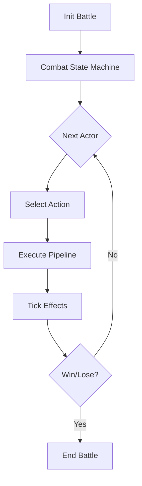
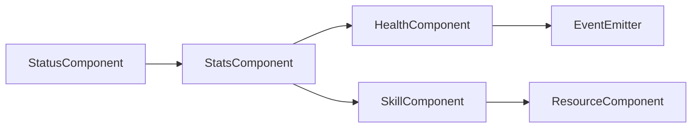

# 📋 Technical Description - TTCS Game

> **Turn-Based Combat System với Timing Mechanics**  
> Tài liệu kỹ thuật chi tiết cho dự án game 2D RPG

---

## 🎯 1. Mục tiêu kỹ thuật

### 🎮 Game Design Goals
Xây dựng game **2D turn-based** có nhịp chiến đấu nhanh, nhưng vẫn có chiều sâu chiến thuật nhờ:

- ⚔️ **Hệ thống lượt** + timeline rõ ràng
- ⏱️ **Cơ chế timing input** (guard/parry/cast) tạo "gamefeel"

### 🏗️ Architecture Goals
Kiến trúc code theo hướng tách **dữ liệu – logic – trình bày** để dễ mở rộng:

- 📊 **Data-driven**: nhân vật/kỹ năng/quái/boss/config
- 📡 **Event-driven**: combat events, UI events  
- 🤖 **State machine**: AI và flow trận đấu

### ✅ Production Goals
Hoàn thiện trọn vòng sản phẩm:
- UI/UX hoàn chỉnh
- Save/Load system
- Balance & tuning
- Debug tools

---

## 🏛️ 2. Kiến trúc tổng thể

### 📐 2.1. Phân lớp hệ thống (Layered Architecture)

```
┌─────────────────────────────────────────────────────┐
│           PRESENTATION LAYER                        │
│  UI • Scenes • VFX • Audio • Input Handling         │
└─────────────────────────────────────────────────────┘
                        ↕
┌─────────────────────────────────────────────────────┐
│           GAME LOGIC LAYER                          │
│  Combat • Systems • Progression • Gacha • Quest     │
└─────────────────────────────────────────────────────┘
                        ↕
┌─────────────────────────────────────────────────────┐
│           DATA LAYER                                │
│  Static Data • Save Data • Localization             │
└─────────────────────────────────────────────────────┘
                        ↕
┌─────────────────────────────────────────────────────┐
│           INFRASTRUCTURE                            │
│  Event Bus • RNG • Logging • Asset Loading          │
└─────────────────────────────────────────────────────┘
```

#### 🎨 Presentation Layer
- **UI**: HUD, menus, gacha, inventory, team builder
- **Scene/Screen controllers**: điều hướng màn
- **VFX/Audio feedback**: hitstop, camera shake, sfx
- **Input handling**: buffer, timing windows

#### 🎲 Game Logic Layer
- **Combat engine**: turn/timeline, resolve actions, timing grade
- **Systems**: stats, status effects, buffs/debuffs, cooldown
- **Progression**: level up, gear, relics
- **Gacha** + roster management
- **Quest/progression** manager

#### 💾 Data Layer
- **Static data**: Characters, Skills, Enemys, Items, Stages (JSON/ScriptableObject/Resource)
- **Save data**: profile, currency, roster, progress, settings
- **Localization**: Nếu muốn phát triển bản đa ngôn ngữ

#### ⚙️ Infrastructure (Nền tảng game)
- **Event bus** / message dispatcher
- **RNG service** (seeded)
- **Logging** + diagnostics
- **Asset loading/caching** (pooling)

---

## 📊 3. Data-driven: Mô hình dữ liệu cốt lõi

### 👤 3.1. Character Definition

Mỗi nhân vật được định nghĩa bằng một bản ghi dữ liệu `CharacterDef`, gồm:

| Category | Properties | Description |
|----------|------------|-------------|
| **🎯 Metadata** | `id`, `nameKey`, `rarity`, `factionTag`, `roleTag` | Thông tin cơ bản |
| **💪 Base Stats** | `hp`, `atk`, `def`, `spd`, `crit`, `resist` | Chỉ số chiến đấu |
| **📈 Growth** | Curve hoặc bảng theo level | Tăng trưởng |
| **⚡ Skills** | 3-4 kỹ năng + ultimate | Bộ kỹ năng |
| **🌟 Passive** | Talents/Perks | Khả năng đặc biệt |
| **🎬 Visual** | Animation/VFX references | Tài nguyên hình ảnh |
| **🤖 AI** | Hints cho auto mode | Gợi ý AI |

**Example Structure:**
```json
{
  "id": "char_001",
  "nameKey": "Aelith_Shadowblade",
  "rarity": "SSR",
  "factionTag": "Forgotten",
  "roleTag": "Attacker",
  "baseStats": {
    "hp": 2500,
    "atk": 350,
    "def": 120,
    "spd": 145,
    "crit": 0.25,
    "resist": 0.15
  },
  "skills": ["skill_001", "skill_002", "skill_003", "ultimate_001"]
}
```

### ⚡ 3.2. Skill Definition

Một kỹ năng `SkillDef` mô tả thuần dữ liệu:

**Components:**

| Section | Fields | Purpose |
|---------|--------|---------|
| **📝 Metadata** | `id`, `nameKey`, `type`, `targetRule` | Định danh và phân loại |
| **💰 Cost** | `mana/stamina`, `cooldown`, `limitPerFight` | Chi phí sử dụng |
| **💥 Damage** | Formula, scaling | Công thức sát thương |
| **✨ Effects** | Effect list với conditions | Hiệu ứng kỹ năng |
| **⏱️ Timing** | Windows, grades, bonus | Cơ chế timing |

**Example:**
```json
{
  "id": "skill_flame_slash",
  "nameKey": "Flame Slash",
  "type": "attack",
  "targetRule": "single_enemy",
  
  "cost": {
    "mana": 30,
    "cooldown": 2
  },
  
  "damage": {
    "formula": "ATK * 1.5",
    "element": "fire"
  },
  
  "effects": [
    {"type": "burn", "duration": 3, "chance": 0.6}
  ],
  
  "timing": {
    "windows": [{"startMs": 200, "endMs": 400}],
    "grades": {
      "perfect": {"threshold": 50, "bonus": "+20% dmg"},
      "good": {"threshold": 150, "bonus": "none"},
      "miss": {"threshold": 999, "penalty": "no bonus"}
    }
  }
}
```

**Effect Types:**
- 🩸 **Bleed**: Tick damage over time
- 🔥 **Burn**: Fire damage over time
- 💚 **Heal**: Restore HP
- 🔄 **Dispel**: Remove buffs/debuffs
- 🛡️ **Shield**: Absorb damage
- 🎯 **Taunt**: Force targeting
- 🎭 **Mark**: Increase damage taken

### 👹 3.3. Enemy/Boss Definition

| Component | Description |
|-----------|-------------|
| **💪 Stats** | Base stats + resist table |
| **⚔️ Move Set** | Kỹ năng theo phase |
| **🎲 Patterns** | Weights / conditions |
| **📢 Telegraph** | Cue type, duration |
| **🔄 Phase Triggers** | HP threshold, turn count, status |

**Boss Example:**
```json
{
  "id": "boss_forgotten_knight",
  "phases": [
    {
      "phase": 1,
      "hpRange": [100, 60],
      "moves": ["slash", "guard", "charge"],
      "weights": [40, 30, 30]
    },
    {
      "phase": 2,
      "hpRange": [60, 0],
      "moves": ["fury_slash", "counter", "rage_mode"],
      "weights": [35, 25, 40]
    }
  ]
}
```

### 🗺️ 3.4. Stage/Battle Definition

- **📜 Encounter list**: waves, spawn order
- **🎁 Loot table**: drops, currency range
- **🌍 Rule modifiers**: environment effects (vd: fog → -accuracy)
- **🎵 Theme**: Music/VFX theme

---

## ⚔️ 4. Combat Engine: Luồng chiến đấu

### 🔄 4.1. Combat Loop cấp cao

**Flow Diagram:**


**Quy trình chi tiết:**

1. ⚙️ **Init battle**: load stage, spawn entities, init RNG seed
2. 🎮 **Start combat** state machine
3. 🔁 **Loop**:
   - 👥 Determine next actor (turn order hoặc timeline)
   - 🎯 Actor selects action (player input / AI decision)
   - ⚡ Execute action pipeline
   - 🕐 Tick status effects + cooldown
   - ✅ Check win/lose conditions
4. 🏆 **End battle**: rewards, progression, log

### ⏱️ 4.2. Turn Order System

#### 📊 Timeline (SPD-based) - **KHUYẾN NGHỊ**

**Cơ chế:**
- Mỗi entity có **initiative** = SPD
- Sau khi hành động, initiative tăng theo **action cost**
- Entity có initiative thấp nhất hành động trước

**Ưu điểm:**
- ✅ Cảm giác "nhịp" hay, giống game hiện đại
- ✅ SPD stat có ý nghĩa rõ ràng
- ✅ Dễ balance và tune

> 💡 **Khuyến nghị implemention**:
> - Giữ đơn giản: `queue theo SPD + fixed cost`
> - Tránh phức tạp hóa với quá nhiều biến số
> - Cost chuẩn: normal action = 100, fast = 80, slow = 120

### 🔥 4.3. Action Pipeline (⚠️ QUAN TRỌNG)

Mỗi action (Skill/Attack/Guard) đi qua **7 bước** trong pipeline:

```
┌─────────────────┐
│  1. VALIDATE    │  → Đủ cost? Cooldown OK? Target hợp lệ?
└────────┬────────┘
         ↓
┌─────────────────┐
│  2. COMMIT      │  → Trừ cost, set cooldown, lock target
└────────┬────────┘
         ↓
┌─────────────────┐
│  3. TELEGRAPH   │  → Hiển thị cue (đặc biệt với enemy attack)
└────────┬────────┘
         ↓
┌─────────────────┐
│  4. TIMING      │  → Mở cửa sổ input (parry/dodge/cast)
│     WINDOW      │  → Chấm điểm: Perfect/Good/Miss
└────────┬────────┘
         ↓
┌─────────────────┐
│  5. RESOLVE     │  → Tính damage/heal theo formula
│                 │  → Áp dụng effects theo thứ tự
│                 │  → Trigger: on-hit, on-crit, on-kill, on-parry
└────────┬────────┘
         ↓
┌─────────────────┐
│  6.POST-RESOLVE │  → Tick status, remove expired, trigger passive
└────────┬────────┘
         ↓
┌─────────────────┐
│  7.EMIT EVENTS  │  → Bắn sự kiện để UI/VFX/Audio bắt
└─────────────────┘
```

### ⏰ 4.4. Timing System (Core của "Soulslike Feel")

**Window Mechanics:**
- Timing window chạy theo **thời gian (ms)** hoặc **normalized animation time**
- Input được **buffer** để tránh "bấm hụt":
  - Buffer vài frame (60-100ms) trước khi window mở
  - Cho phép input sớm được chấp nhận

**Grading System:**

| Grade | Window | Effect | Visual Feedback |
|-------|--------|--------|-----------------|
| **🌟 Perfect** | ±50ms | Phản đòn / giảm sát thương 80% / +bonus proc | Gold flash, slow-mo |
| **✅ Good** | ±150ms | Giảm sát thương 40% / không bonus | Blue flash |
| **❌ Miss** | Outside | Ăn full damage / có thể +debuff | Screen shake |

**Hệ thống Cue (Telegraph):**
- **Visual**:
  - Ring shrink animation
  - Flash warning
  - Icon indicator
- **Audio**:
  - Metronome tick
  - Warning chime
  - Perfect hit sound
- **Haptic** (nếu có controller support)

**Code Example:**
```csharp
public enum TimingGrade {
    Perfect,  // ±50ms
    Good,     // ±150ms
    Miss      // Outside window
}

public class TimingWindow {
    public float startTime;
    public float perfectThreshold = 0.05f;  // 50ms
    public float goodThreshold = 0.15f;     // 150ms
    
    public TimingGrade EvaluateInput(float inputTime) {
        float delta = Mathf.Abs(inputTime - startTime);
        if (delta <= perfectThreshold) return TimingGrade.Perfect;
        if (delta <= goodThreshold) return TimingGrade.Good;
        return TimingGrade.Miss;
    }
}
```

### 🧪 4.5. Status Effects System

**Mô hình: Effect + Modifier**

#### Effect Properties

| Property | Description |
|----------|-------------|
| **⏰ Duration** | Theo turn hoặc action count |
| **🕐 Tick Timing** | start turn / end turn / on hit / on being hit |
| **📊 Intensity** | Giá trị effect (damage, heal%, etc.) |
| **🔢 Stack Rules** | refresh / stack count / stack value |

#### Modifier Types
- **Stat Modifiers**: Thay đổi stat theo % hoặc flat
- **Behavioral**: Stun, freeze, taunt
- **Damage Over Time**: Bleed, burn, poison

**Common Effects:**

| Effect | Type | Tick Timing | Stack Rule |
|--------|------|-------------|------------|
| **🩸 Bleed** | DoT | End Turn | Stack Count (max 5) |
| **🔥 Burn** | DoT | End Turn | Stack Value |
| **❄️ Freeze** | Control | Start Turn | Refresh |
| **😵 Stun** | Control | - | No Stack |
| **😰 Weak** | Debuff | - | Stack Value |
| **🎯 Vulnerable** | Debuff | - | Stack Value |
| **🛡️ Shield** | Buff | - | Stack Value |
| **🎭 Taunt** | Control | - | Refresh |
| **📍 Mark** | Debuff | - | No Stack |

**Example Implementation:**
```csharp
public class StatusEffect {
    public string effectId;
    public int duration;        // Turns remaining
    public float intensity;     // Effect value
    public int stackCount;      // Number of stacks
    public TickTiming tickTiming;
    
    public void Tick(CombatEntity target) {
        switch(tickTiming) {
            case TickTiming.EndTurn:
                ApplyEffect(target);
                duration--;
                break;
        }
    }
}
```

### 🎮 4.6. Combat Entities & Components

Mỗi entity trong battle có các **component**:

```
CombatEntity
├── 📊 StatsComponent (base + bonus + current)
├── ❤️  HealthComponent (hp, shield)
├── ⚡ ResourceComponent (mana/stamina)
├── 🎯 SkillComponent (skills list + cooldown tracking)
├── ✨ StatusComponent (active effects list)
├── 🤖 AIComponent (chỉ enemies)
├── 🎬 VisualComponent (animation refs)
└── 📡 EventEmitter (broadcast events)
```

**Component Interaction:**


---

## 🤖 5. AI System

### 🎲 5.1. AI cho quái thường (Rule-based)

**Target Evaluation:**
- Ưu tiên mục tiêu theo **threat score**:
  - HP thấp → higher priority
  - Role (healer > DPS > tank)
  - Debuff synergy (đã có mark → ưu tiên đánh)

**Move Selection:**
```
IF player is shielding:
    → Use dispel skill
ELSE IF player HP < 30%:
    → Use finisher skill
ELSE IF self HP < 50%:
    → Use defensive skill
ELSE:
    → Random from move pool (weighted)
```

**Advantages:**
- ✅ Simple, dễ implement
- ✅ Dễ debug và tune
- ✅ Predictable nhưng không boring (nhờ weights)

### 🧠 5.2. Boss AI (Finite State Machine)

**FSM Structure:**

```
┌──────────────┐
│   Phase 1    │ HP: 100% → 60%
│              │ Moves: Slash, Guard, Charge
└──────┬───────┘
       │ Transition: HP < 60%
       ↓
┌──────────────┐
│   Phase 2    │ HP: 60% → 30%
│              │ Moves: Fury, Counter, Rage
└──────┬───────┘
       │ Transition: HP < 30%
       ↓
┌──────────────┐
│   Phase 3    │ HP: 30% → 0%
│   (Enraged)  │ Moves: Desperation, Ultimate
└──────────────┘
```

**Move Design Philosophy:**

| Phase | Move Type | Telegraph | Punish | Purpose |
|-------|-----------|-----------|--------|---------|
| **Early** | "Teach" | Dài (2s) | Nhẹ | Dạy pattern cho player |
| **Mid** | "Test" | Trung bình (1s) | Trung bình | Mix-up patterns |
| **Late** | "Punish" | Ngắn (0.5s) | Nặng | Feint, guard-break |

**Example Boss Pattern:**
```json
{
  "bossId": "forgotten_knight",
  "phases": [
    {
      "id": "phase_1",
      "hpThreshold": [100, 60],
      "moves": [
        {
          "id": "vertical_slash",
          "telegraphDuration": 1.5,
          "timingWindow": 0.3,
          "damage": "ATK * 1.2",
          "weight": 40
        },
        {
          "id": "shield_bash",
          "telegraphDuration": 1.0,
          "canBeParried": true,
          "weight": 30
        }
      ]
    }
  ]
}
```

---

## 🎰 6. Gacha & Roster System

### 💰 6.1. Currency & Banners

**Currency Types:**

| Currency | Source | Use |
|----------|--------|-----|
| **🪙 Gold** | Battle rewards, quests | Upgrades, shop |
| **💎 Gems** | Story, achievements, (premium sim) | Gacha pulls |
| **🧩 Shards** | Duplicate characters | Rank up, ascend |

**Banner Configuration:**
```json
{
  "bannerId": "forgotten_heroes",
  "pool": ["char_001", "char_002", "char_003"],
  "rateUp": ["char_001"],
  "rates": {
    "SSR": 0.03,   // 3%
    "SR": 0.12,    // 12%
    "R": 0.85      // 85%
  },
  "pity": {
    "softPity": 75,
    "hardPity": 90
  }
}
```

### 🎲 6.2. RNG & Fairness

**RNG Service:**
- **Seeded RNG** cho debugging
- **PRNG chuẩn**: Mersenne Twister hoặc PCG
  - Không cần crypto-grade cho game
  - Quan trọng: deterministic với cùng seed

**Pity System:**

| Type | Mechanism | Purpose |
|------|-----------|---------|
| **🛡️ Hard Pity** | Đảm bảo SSR sau N pulls | Player protection |
| **📈 Soft Pity** | Tăng tỷ lệ từ pull K | Cảm giác "gần trúng" |

**Example:**
```
Normal rate: 3%
From pull 75: rate increases by +2% per pull
Pull 90: Guaranteed SSR (100%)
```

### ♻️ 6.3. Duplicate Handling

**Conversion System:**
```
Duplicate pull → Convert to shards
```

**Shard Usage:**
- **Rank up**: Unlock passive abilities
- **Ascend stats**: Tăng stat cap

**Balance Design:**
- SSR mạnh nhưng **không bắt buộc**
- **Skill synergy > rarity**
- SR/R characters vẫn viable với team comp tốt

### 👥 6.4. Team Builder

**Features:**
- **Roster view** với filters:
  - Role (Attacker/Defender/Support)
  - Rarity (SSR/SR/R)
  - Faction tag
- **Party slots**: 3 characters
- **Validation rules** (optional):
  - Unique constraint (không duplicate char)
  - Cost cap (budget system)
- **Save presets**: 1-3 team presets

---

## 📈 7. Progression & Economy

### ⬆️ Level Up System

**Character Leveling:**
- **EXP source**: Battle rewards
- **Stat growth**: Theo curve (exponential hoặc linear)

```
Level 1 → 20: Linear growth
Level 20 → 50: Exponential curve
Max Level: 50
```

### 🎭 Gear/Relic System (Optional)

**Relic Slot:**
- Mỗi character: **1 relic slot**
- **Relic effects**:
  - Passive abilities (vd: +bleed synergy, +parry bonus)
  - Stat bonuses

**Example Relic:**
```json
{
  "relicId": "bloodthirsty_ring",
  "name": "Ring of the Bloodthirsty",
  "passive": {
    "type": "on_bleed_applied",
    "effect": "+20% damage to bleeding enemies"
  },
  "stats": {
    "atk": +50,
    "crit": +0.05
  }
}
```

### 🎁 Reward Pipeline

**Sources:**
```
Battle Rewards
   ├── Base reward (clear reward)
   ├── First clear bonus
   └── Performance bonus (timing score)

Quest Rewards
   ├── Story quest
   ├── Daily quest
   └── Achievement
```

---

## 💾 8. Save/Load & Profile System

### 📂 8.1. Save Data Structure

```json
{
  "profile": {
    "profileId": "uuid-1234",
    "createdAt": "2026-02-21T10:00:00Z",
    "playtime": 12345
  },
  
  "currencies": {
    "gold": 50000,
    "gems": 1200,
    "shards": 350
  },
  
  "roster": [
    {
      "charId": "char_001",
      "level": 35,
      "rank": 2,
      "exp": 12500,
      "equippedRelic": "relic_001"
    }
  ],
  
  "progress": {
    "unlockedStages": ["stage_01", "stage_02"],
    "storyFlags": ["intro_complete", "chapter1_clear"]
  },
  
  "settings": {
    "audioVolume": 0.8,
    "graphicsQuality": "high",
    "timingAssist": false
  },
  
  "gacha": {
    "bannerPityCounters": {
      "banner_01": 45
    }
  }
}
```

### 💿 8.2. Save Strategy

**Auto-save Triggers:**
- ✅ End battle
- ✅ Gacha pull
- ✅ Character upgrade
- ✅ Settings change

**Backup System:**
```
save_slot_0.json        (Current)
save_slot_0.bak         (Backup)
```

**Versioning:**
```json
{
  "schemaVersion": "1.2.0",
  "data": { ... }
}
```
- Cho phép **migration** khi cấu trúc thay đổi
- Rất quan trọng cho báo cáo (show professionalism)

---

## 🎨 9. UI/UX Kỹ thuật (Gamefeel)

### 🖥️ Combat HUD

**Components:**
```
┌────────────────────────────────────────┐
│  Timeline Bar                          │
│  [A]──[E]────[P]──────[E]             │
├────────────────────────────────────────┤
│  Player Team        Enemy Team        │
│  [HP▓▓▓░░░]        [HP▓▓▓▓▓░]        │
│  [MP▓▓▓▓░░]        Status: Bleed x3   │
│  Status: Shield x1                     │
├────────────────────────────────────────┤
│  Timing Window                         │
│     ◄═══●═══►                          │
│    Perfect  Good                       │
└────────────────────────────────────────┘
```

### 🎮 Input System

**Features:**
- **Input buffering**: Accept input 60-100ms trước window
- **Latency compensation**: Tùy chỉnh cho từng device
- **Accessibility**: "Timing Assist" mode
  - Mở rộng window 20-30%
  - Highlight cue rõ hơn

### 🎆 Feedback System

**Visual Feedback:**
- **Hitstop**: Freeze frame khi đánh trúng (2-5 frames)
- **Camera shake**: Intensity theo damage/grade
  - Perfect hit: Strong shake
  - Normal hit: Light shake
- **VFX pooling**: Tái sử dụng particles để tránh GC spike

**Audio Feedback:**
- **Layered sounds**:
  - Base hit sound
  - Perfect parry: Thêm "ding!" đặc biệt
  - Critical hit: Deeper bass
- **Dynamic mixing**: Adjust volume theo intensity

---

## ⚡ 10. Performance & Optimization

### 🔄 Object Pooling

**Pooled Objects:**
- Damage numbers
- VFX particles
- UI floating texts
- Projectiles

### 🎨 Rendering

- **Sprite batching**: Sử dụng sprite atlas
- **Draw call reduction**: Combine meshes khi possible

### 💻 Code Optimization

**Best Practices:**
- ❌ Avoid per-frame allocations
- ✅ Reuse `List<>`, `Dictionary<>`
- ✅ Use `struct` cho events
- ✅ Cache strings (đặc biệt keys)

**Fixed Update:**
- Timing logic chạy trong `FixedUpdate` để đồng nhất
- Avoid frame rate dependency

### 📊 Profiling

**Metrics to track:**
- Frame time (target: <16.67ms cho 60fps)
- GC allocations
- Draw calls
- Memory usage

### 📦 Data Loading

- **Preload** static data khi start game
- **Lazy load** VFX/Audio theo stage
- **Async loading** cho scene transitions

---

## 🔧 11. Debug & Tooling

### 📝 Combat Log

**Event Recording:**
```
[Turn 3] Actor: Player_1
[Action] Skill: Flame Slash (char_001_skill_02)
[Target] Enemy_1
[Timing] Grade: Perfect (+50ms)
[Damage] 450 (base 350 + 100 bonus)
[Effect] Applied: Burn (3 turns)
[Status] Enemy_1: HP 2100 → 1650
```

### 🎬 Replay System

**Mechanics:**
- Lưu **seed + input sequence**
- Cho phép tái hiện chính xác trận đấu
- Dùng cho debug và testing

### 👨‍💻 Developer Panel

**Features:**
- Spawn enemy bất kỳ
- Set HP/stats
- Give currency
- Unlock all stages
- Modify timing windows (testing)

### ✅ Data Validation

**Checks:**
- Skill references tồn tại
- No missing IDs
- No circular effect dependencies
- Stat ranges hợp lệ

---

## 🧪 12. Testing & Quality Assurance

### 🔬 Unit Tests

**Test Coverage:**
```csharp
// Damage Formula
TestDamageCalculation()
TestCriticalHit()
TestElementalBonus()

// Status Effects
TestBleedStack()
TestFreezeSkipTurn()
TestShieldAbsorb()

// Cooldown System
TestCooldownDecrement()
TestSkillUnavailableDuringCooldown()

// Gacha/Pity
TestHardPityGuaranteed()
TestSoftPityRateIncrease()
```

### 🤖 Integration Tests

**Battle Simulation:**
```
Run 1000 AI vs AI battles:
  ✅ Check for crashes
  ✅ Balance validation (win rate ~50%)
  ✅ Performance metrics
```

### 🏆 Golden Tests

**Deterministic Testing:**
- Với seed cố định → Kết quả phải giống nhau
- Dùng để phát hiện regression bugs

---

## 📦 13. Implementation Modules

### Giai đoạn triển khai theo priority

| Priority | Module | Components | Estimated Time |
|----------|--------|------------|---------------|
| **🔴 P0** | **Core Framework** | Event bus, RNG, Data loading, Save system | Week 1-2 |
| **🟠 P1** | **Combat Core** | Entities, Components, Turn manager, Action pipeline | Week 3-4 |
| **🟡 P2** | **Timing System** | Timing windows, Grading, Telegraph | Week 5 |
| **🟢 P3** | **Content** | Character/Skill/Enemy defs, Stages | Week 6-7 |
| **🔵 P4** | **Meta Systems** | Gacha, Roster, Upgrades, Relics | Week 8-9 |
| **🟣 P5** | **UI/UX Polish** | HUD, VFX pooling, Audio feedback | Week 10-11 |
| **⚪ P6** | **Tools & Tests** | Debug panel, Logs, Tests | Week 12 |

---

## 📖 Appendix: Best Practices

### 💡 Code Guidelines

**Naming Conventions:**
```csharp
// Classes: PascalCase
public class CombatEntity { }

// Methods: PascalCase
public void ApplyDamage() { }

// Variables: camelCase
private int currentHealth;

// Constants: UPPER_SNAKE_CASE
public const int MAX_PARTY_SIZE = 3;
```

**Architecture Principles:**
- 🎯 **Single Responsibility**: Mỗi class một nhiệm vụ
- 🔒 **Encapsulation**: Hide internal details
- 🔄 **DRY**: Don't Repeat Yourself
- 📡 **Event-Driven**: Loose coupling via events

### 📚 Recommended Tools

**Unity Packages:**
- DOTween: Animation/tweening
- TextMeshPro: Better text rendering
- UniTask: Async/await performance

**External:**
- Version control: Git + GitLFS
- CI/CD: GitHub Actions (optional)
- Analytics: Unity Analytics (optional)

---

## ✅ Summary Checklist

- [ ] Core framework implemented
- [ ] Combat system functional
- [ ] Timing mechanics polished
- [ ] AI behaviors tested
- [ ] Gacha/Roster working
- [ ] Save/Load reliable
- [ ] UI/UX complete
- [ ] Performance optimized
- [ ] Debug tools ready
- [ ] Tests passing
- [ ] Documentation complete

---

**Document Version**: 1.0  
**Last Updated**: February 21, 2026  
**Author**: TTCS Development Team
