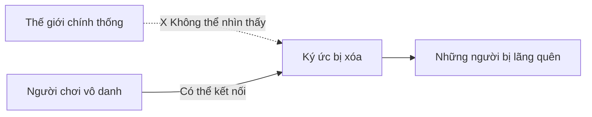

# 📖 NHỮNG NGƯỜI BÊN RÌA LỊCH SỬ

> **Those at The Crossroads of Story**  
> *Một câu chuyện về ký ức, sự thật, và những người bị lãng quên*

---

## 🌍 Prologue: Thế giới sau chiến tranh

```
Thế giới này từng trải qua một cuộc chiến 
mà không ai muốn nhắc lại.
```

Khi đại họa kết thúc, các vương quốc còn sống sót đã làm một việc tưởng như đơn giản: **viết lại lịch sử**. 

**Không phải để dối trá vì quyền lực,**  
**Mà để thế giới có thể tiếp tục tồn tại.**

Những gì quá đau đớn, quá mâu thuẫn, quá nguy hiểm để kể ra… đã bị bỏ đi.

> ⚠️ **Hậu quả**: Không phải tất cả con người đều được giữ lại trong câu chuyện ấy.

---

## 👥 Chapter 1: Những kẻ bị bỏ lại

### 💔 Ai là họ?

Trong cuộc chiến năm xưa, có những người:

```
⚔️  Chiến đấu đến hơi thở cuối cùng
    ├── Nhưng không thuộc về phe chiến thắng
    
🎯  Làm điều đúng đắn
    ├── Nhưng bằng cách không thể tha thứ
    
💚  Cứu được hàng nghìn người
    └── Nhưng để lại một sự thật không ai dám đối diện
```

### ❓ Số phận của họ

**Họ không bị xử tử.**  
**Họ không bị nguyền rủa.**

### ✨ Họ chỉ bị loại khỏi lịch sử.

```
┌─────────────────────────────────────────┐
│  Tên của họ → Không còn được nhắc đến  │
│  Ký ức về họ → Phai mờ dần              │
│  Nhưng bản thân họ...                   │
│                                         │
│  ❌ Không thể chết hẳn                  │
│  ❌ Không thể sống tiếp                 │
│  ✅ Mắc kẹt giữa quá khứ và hiện tại   │
└─────────────────────────────────────────┘
```

### 🌫️ Trạng thái tồn tại

Họ trở thành những **bóng ma của lịch sử** - không còn được nhớ, nhưng vẫn chưa biến mất hoàn toàn.

---

## 🎭 Chapter 2: Người còn nhớ

### 👤 Nhân vật chính - Kẻ vô danh

> *"Người duy nhất trong thời đại này vẫn có thể nghe thấy tiếng gọi của những kẻ bị quên lãng."*

### 🎯 Tại sao lại là bạn?

```
❌  Không phải vì sức mạnh
❌  Không phải vì dòng máu  
❌  Không phải vì định mệnh

✅  Vì bạn chưa từng được nhắc đến 
    trong bất kỳ trang sử nào
```

### 💡 Ý nghĩa

**Bạn không thuộc về câu chuyện chính thống,**  
**Và chính vì vậy...**

> 🔑 Bạn có thể chạm tới những phần đã bị gạt bỏ.

### 🌟 Khả năng đặc biệt



---

## ⚔️ Chapter 3: Những anh hùng không tên

### 👻 Bản chất của họ

Những người bạn gặp **không phải**:
- ❌ Linh hồn được triệu hồi
- ❌ Ký ức được tạo ra  
- ❌ Ma quái hay ảo ảnh

**Họ là những con người đã từng sống thật.**

### 📜 Những câu chuyện thật

| Nhân vật | Hành động | Bị gọi là | Sự thật |
|----------|-----------|-----------|---------|
| **🛡️ Hiệp sĩ** | Phản lệnh để cứu thường dân | Kẻ phản bội | Cứu 1000 người |
| **🔥 Pháp sư** | Đốt cháy chiến trường | Kẻ gây thảm họa | Chấm dứt chiến tranh sớm 5 năm |
| **⚔️ Tướng quân** | Rút lui trong giờ quyết định | Kẻ hèn nhát | Giữ mạng cho 10,000 lính |

### 💬 Câu hỏi duy nhất

Khi bạn gặp họ, họ không hỏi được minh oan.

**Họ chỉ hỏi một điều:**

> *"Nếu ngươi biết sự thật… ngươi sẽ làm gì với nó?"*

### 🎯 Quest Design

Mỗi character encounter:

```
1. 📖 Discover → Tìm hiểu quá khứ
2. ⚔️ Prove → Chiến đấu cùng họ  
3. 💭 Understand → Hiểu lý do
4. 🎯 Decide → Lựa chọn của bạn
```

---

## 🗺️ Chapter 4: Thế giới bị bóp méo

### 🌍 Vùng đất game

Những vùng đất bạn đi qua **không phải là hiện tại**, mà là **dấu vết của những câu chuyện đã bị kể sai**.

### 🔄 Sự bóp méo lịch sử

```
LỊCH SỬ CHÍNH THỨC          →    SỰ THẬT
──────────────────────────────────────────────
⛪ Chiến trường → Thánh địa      Nơi thảm sát
🏆 Chiến thắng vẻ vang           10,000 thường dân chết
🔥 Hy sinh cần thiết             Ngôi làng bị thiêu rụi
👑 Vua anh minh                  Giết người vô tội
```

### 👹 Enemies: Sinh vật của lời nói dối

Những thực thể thù địch sinh ra từ đó:

> **Không phải quái vật thông thường,**  
> **Mà là những lời nói dối đã tồn tại quá lâu,**  
> **Đến mức chúng tự cho rằng mình là sự thật.**

**Types of Distortions:**

| Enemy Type | Origin | Behavior |
|-----------|--------|----------|
| **🌫️ Memory Wraith** | Ký ức bị xóa | Tấn công perception |
| **⚔️ False Heroes** | Anh hùng giả dối | Tank bảo vệ lịch sử sai |
| **📜 Script Keeper** | Người ghi chép | Summon thêm distortions |
| **🎭 Truth Denier** | Boss | Cực kỳ mạnh nếu tin vào lịch sử giả |

### 🎨 Visual Design

```
Normal World       →  Corroded by lies
(Bright, clean)       (Dark, twisted)

└─────────────────────────────────────┘
    Player fights to reveal truth
```

---

## 👑 Chapter 5: Những người được ở lại

### 🏛️ Những biểu tượng

Ở cuối mỗi vùng đất là **những kẻ đã được lịch sử lựa chọn để tồn tại**.

**Họ là những biểu tượng:**

```
👑  Vị vua mang lại hòa bình
    └── Tượng đài giữa quảng trường
    
🌟  Vị thánh chấm dứt chiến tranh
    └── Được thờ phụng khắp nơi
    
⚔️  Anh hùng cứu thế giới
    └── Tên tuổi được tạc vào đá
```

### 🎭 Complexity - Không phải villains

**Họ biết rõ:**
- ✅ Những cái tên đã biến mất
- ✅ Ai đã trả giá thay cho họ
- ✅ Sự thật đằng sau vinh quang

**Nhưng họ đã chọn im lặng.**

### 💭 Lý do của họ

> *"Có những sự thật, nếu nói ra,  
> sẽ giết chết nhiều người hơn cả chiến tranh."*

```
┌────────────────────────────────────────┐
│  Không phải ác tâm                     │
│  Không phải trốn tránh                 │
│                                        │
│  Mà vì họ tin rằng:                    │
│  "Hòa bình > Sự thật"                  │
└────────────────────────────────────────┘
```

### ⚔️ Boss Fights

**Mechanical + Narrative Integration:**

| Boss | Represents | Fight Mechanic | Narrative Weight |
|------|-----------|----------------|------------------|
| **👑 The King** | Quyền lực trật tự | Shield mechanics | "Bảo vệ hòa bình" |
| **🌟 The Saint** | Tôn giáo | Heal + buff | "Tha thứ vs Công lý" |
| **⚔️ The Hero** | Lịch sử anh hùng | All-rounder | "Icon vs Truth" |

**Fight Philosophy:**
- Phase 1: Họ defend lịch sử
- Phase 2: Cracks in their conviction
- Phase 3 (Optional): Họ acknowledge truth nhưng vẫn fight vì "greater good"

---

## 💡 Chapter 6: Sự thật không ai muốn giữ

### 🔍 Revelation

Càng đi sâu, bạn càng hiểu ra một điều đáng sợ:

```
╔════════════════════════════════════════╗
║                                        ║
║  Không ai ép buộc những kẻ bị lãng    ║
║  quên biến mất.                        ║
║                                        ║
║  HỌ ĐÃ TỰ CHẤP NHẬN ĐIỀU ĐÓ.          ║
║                                        ║
╚════════════════════════════════════════╝
```

### 💔 Sacrifice

**Họ để:**
- Lịch sử gọi mình là kẻ xấu
- Tên mình tan biến khỏi ký ức
- Người khác nhận công lao

**Miễn là:**
> Những người họ bảo vệ có thể sống tiếp  
> Mà không mang gánh nặng của sự thật.

### 🎯 Character Motivation

```
Hiệp sĩ phản bội:
"Để dân làng sống yên ổn,
tôi sẵn sàng mang tiếng phản bội."

Pháp sư hủy diệt:
"Để chiến tranh kết thúc,
tôi chấp nhận bị gọi là quỷ."

Tướng quân rút lui:
"Để lính sống sót,
tôi chấp nhận bị gọi là hèn nhát."
```

### 💬 Dialogue với Player

> **Forgotten Knight**: *"Ta không muốn được tha thứ."*
>
> **Player**: *"Vậy ngươi muốn gì?"*
>
> **Forgotten Knight**: *"...Chỉ muốn có người biết rằng ta đã từng tồn tại."*

---

## 🎯 Chapter 7: Quyết định cuối cùng

### 🔱 The Final Choice

Khi mọi mảnh ghép được đặt vào đúng chỗ, **bạn buộc phải lựa chọn.**

### 🌟 Path A: Công bố sự thật

```
┌─────────────────────────────────────┐
│ ✨ NẾU BẠN ĐƯA SỰ THẬT RA ÁNH SÁNG │
└─────────────────────────────────────┘

Kết quả:
├── ✅ Lịch sử sẽ thay đổi
├── ✅ Những người bị lãng quên được nhớ lại
├── ❌ Các biểu tượng sụp đổ
├── ❌ Xã hội khủng hoảng niềm tin
└── ⚠️  Thế giới phải đối diện với tội lỗi
```

**Consequences:**
- Hòa bình lung lay
- Conflict mới nổ ra
- Nhưng sự thật được tôn trọng

### 🌑 Path B: Giữ im lặng

```
┌─────────────────────────────────────┐
│ 🤫 NẾU BẠN GIỮ IM LẶNG              │
└─────────────────────────────────────┘

Kết quả:
├── ✅ Hòa bình sẽ tiếp tục
├── ✅ Xã hội ổn định
├── ❌ Những người bị quên sẽ biến mất hoàn toàn
├── ❌ Không còn ai nhớ đến họ nữa
└── ⚠️  Ngoại trừ bạn.
```

**Consequences:**
- Status quo maintained
- Bạn mang burden of truth
- Họ biến mất nhưng peaceful

### ⚖️ The Dilemma

```
        TRUTH          vs        PEACE
         ⚡                       ☮️
    
   Painful but just     vs   Comfortable but false
   Progress through     vs   Stability through
      conflict               ignorance
```

> **Game Question**: Đâu là lựa chọn "đúng"?
>
> **Answer**: **Không có.**  
> Đây là moral complexity, không phải good/evil binary.

### 🎭 Multiple Endings

| Ending | Condition | Tone | Message |
|--------|-----------|------|---------|
| **🌟 Truth Revealed** | Công bố tất cả | Bittersweet | "Progress requires pain" |
| **🌑 Silent Guardian** | Giữ kín tất cả | Melancholic | "Some truths are burdens" |
| **⚖️ Partial Truth** | Tiết lộ một phần | Ambiguous | "Balance is possible?" |
| **💔 Forgotten Together** | Refuse to choose | Tragic | "Become forgotten too" |

---

## 🌅 Chapter 8: Epilogue

### 🎬 Final Scene

```
Lịch sử sẽ không ghi tên bạn.

Không ai biết bạn đã gặp ai,
Đã chiến đấu cùng ai,
Đã làm gì.

Nhưng trước khi tan biến...
```

### 💬 Lời cuối cùng

> **Một giọng nói rất khẽ vang lên:**
>
> *"Ít nhất… lần này, đã có người nhìn thẳng vào chúng ta."*
>
> *"Cảm ơn."*

### 🌟 Post-Credits

```
──────────────────────────────────────

Trong góc sách cũ của thư viện,
Có một cuốn nhật ký không tên,
Ghi lại những câu chuyện không ai tin.

Nhưng nó tồn tại.

Và có lẽ, một ngày nào đó,
Ai đó sẽ đọc nó.

──────────────────────────────────────
```

---

## 🎨 Narrative Design Notes

### 📖 Story Structure

```
Act 1: DISCOVERY (Chapters 1-2)
├── Introduce concept of forgotten
├── Player awakens to calling
└── Learn basic mechanics

Act 2: UNDERSTANDING (Chapters 3-5)
├── Meet multiple forgotten characters
├── Piece together what happened
└── Challenge assumptions

Act 3: RESOLUTION (Chapters 6-8)
├── Confront those who rewrote history
├── Make the final choice
└── See consequences
```

### 🎭 Character Arc Categories

| Type | Role | Example |
|------|------|---------|
| **💔 The Scapegoat** | Blamed unfairly | Knight who "betrayed" |
| **🔥 The Necessary Evil** | Did terrible things for good | Mage who "destroyed" |
| **🛡️ The Protector** | Sacrificed reputation | General who "fled" |
| **📖 The Witness** | Knew truth, suppressed | Scholar who "lied" |

### 💡 Themes Explored

```
┌──────────────────────────────────────┐
│ 💭 MEMORY                            │
│ └── Who controls what is remembered? │
│                                      │
│ ⚖️ JUSTICE                           │
│ └── Is truth always justice?         │
│                                      │
│ 💔 SACRIFICE                         │
│ └── Is anonymity the ultimate gift?  │
│                                      │
│ 🌍 HISTORY                           │
│ └── Who writes history, and why?     │
└──────────────────────────────────────┘
```

### 🎯 Player Emotional Journey

```
Curiosity → Understanding → Empathy → Conflict → Choice → Reflection
   ↓            ↓              ↓         ↓         ↓         ↓
"Who are    "What did     "They were  "What's   "What do  "Did I do
 they?"      they do?"     right..."   right?"   I do?"    the right
                                                            thing?"
```

---

## 📝 Writing Guidelines

### ✍️ Tone

- **Serious** but not preachy
- **Melancholic** but not depressing
- **Thoughtful** but not pretentious
- **Hopeful** despite darkness

### 💬 Dialogue Style

**Forgotten Characters:**
- Speak with weight and acceptance
- No self-pity, no anger
- Reflective, understanding
- Question player, not lecture

**Examples:**

❌ **Bad**: *"Họ đã phản bội ta! Ta căm ghét họ!"*
✅ **Good**: *"Họ làm điều họ phải làm. Ta hiểu."*

❌ **Bad**: *"Ngươi phải giúp ta minh oan!"*
✅ **Good**: *"Sự thật có đáng được biết không? Ngươi quyết định."*

### 🎨 Visual Storytelling

**Environmental Narrative:**
- Statues with wrong names
- Monuments to battles that didn't happen as told
- Graves unmarked but tended
- Symbols that contradict official story

---

## 🎮 Integration với Gameplay

### ⚔️ Mechanical Reinforcement

**Theme → Mechanic connection:**

| Theme | Mechanic | Why |
|-------|----------|-----|
| **Forgotten** | Characters start locked | Must be found/unlocked |
| **Truth** | Perfect timing reveals lore | Precision rewards knowledge |
| **Sacrifice** | Support skills cost HP | Help others at own cost |
| **Memory** | Replay system preserves battles | Nothing is truly lost |

### 📊 Progression Narrative

```
Level 1-20: Learn individual stories
Level 20-35: Piece together bigger picture  
Level 35-50: Understand the conspiracy
Final Boss: Confront the choice
```

---

## ✨ Memorable Moments (Target)

### 🎭 Key Scenes to Nail

1. **🌅 First Encounter**
   - Player meets first forgotten character
   - Realize they can see what others can't
   - Emotional hook established

2. **💔 The Scapegoat's Tale**
   - Character reveals their sacrifice
   - Player realizes they were hero, not villain
   - Challenge assumptions about history

3. **⚔️ Facing the Icon**
   - Boss who rewrote history
   - They're not evil, just pragmatic
   - Moral complexity peak

4. **🎯 The Choice**
   - No time limit, no pressure
   - Just player and the question
   - Consequences shown, not told

5. **🌟 Final Goodbye**
   - Forgotten characters fade
   - Last words of gratitude
   - Emotional payoff

---

## 📖 Worldbuilding Elements

### 🗡️ The War That Was Forgotten

**What actually happened:**
- Multi-faction conflict, no clear good/evil
- Atrocities on all sides
- Victory through terrible compromise
- Peace bought with selective memory

### 🏛️ The Rewriting

**Process:**
```
1. Immediate: Suppress dissent
2. Years 1-5: Simplify narrative  
3. Years 5-10: Education reform
4. Years 10+: Truth becomes myth
5. Present: New generation believes official story
```

### 🎭 Factions (Historical)

| Faction | Goal | Outcome | Remembered As |
|---------|------|---------|---------------|
| **Kingdom Alliance** | Unity | Won, rewrote | "Heroes" |
| **Free Cities** | Independence | Lost | "Villains" |
| **Mage Council** | Knowledge | Destroyed | "Dangerous" |
| **Common Folk** | Survival | Forgotten | N/A |

---

## 🎯 Player Takeaways

**We want players to think about:**

- 💭 Is comfortable lie better than painful truth?
- 📖 Who gets to decide what's worth remembering?
- ⚖️ Can sacrifice be too great, even if willing?
- 🌍 How much of our history is simplified/rewritten?

**And feel:**

- 💔 Empathy for those forgotten
- 🤔 Uncertainty about "right" choice
- 🌟 Weight of bearing truth
- 😌 Satisfaction from witnessing their stories

---

## 📚 Credits & Inspirations

### 🎮 Narrative Inspirations

- **Nier: Automata** - Multiple perspectives, moral complexity
- **What Remains of Edith Finch** - Environmental storytelling
- **Undertale** - Player choice weight
- **Final Fantasy XIV: Shadowbringers** - History vs truth

### 📖 Literary Influences

- **1984** (George Orwell) - History manipulation
- **The Giver** (Lois Lowry) - Controlled memory
- **Eternal Sunshine of the Spotless Mind** - Value of painful memories

---

**Story Version**: 1.0  
**Status**: Narrative Design Complete  
**Next Steps**: 
- [ ] Write specific character backstories
- [ ] Draft key dialogues
- [ ] Create timeline of historical events
- [ ] Design environmental storytelling elements

---

> *"History is written by the victors.  
> But we tell the stories of those who were erased."*
>
> — TTCS Development Team
