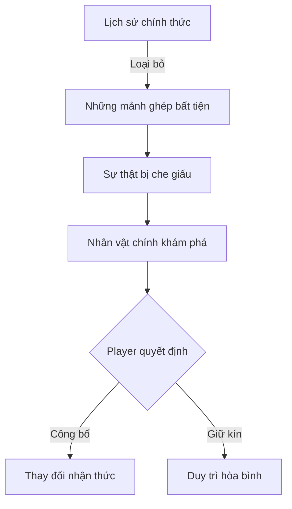

# 📖 Project Description - TTCS Game

> **Those at The Crossroads of Story**  
> Turn-Based RPG với cơ chế timing kết hợp chiều sâu cảm xúc

---

## 🎮 1. Tổng quan dự án

**TTCS (Those at The Crossroads of Story)** là một trò chơi **nhập vai đánh theo lượt (Turn-based RPG)** kết hợp yếu tố **phản xạ thời gian thực**, được phát triển dưới dạng **2D**, lấy cảm hứng từ phong cách chiến đấu giàu tính kịch tính và cảm xúc của các tựa game nhập vai hiện đại.

### 🎯 Mục tiêu thiết kế

Trò chơi hướng tới việc kết hợp giữa:
- 🧠 **Tư duy chiến thuật** - Planning và decision making
- ⚡ **Kỹ năng phản xạ** - Timing và execution
- 💭 **Chiều sâu cảm xúc** - Story và character development

Tạo ra một trải nghiệm chiến đấu **vừa có chiều sâu, vừa mang nhịp độ căng thẳng** thay vì lối chơi đánh theo lượt truyền thống thuần túy.

### 🎨 Phong cách game

| Aspect | Style |
|--------|-------|
| **🎨 Art Style** | 2D Pixel Art / Hand-drawn |
| **⚔️ Combat** | Turn-based + Real-time timing |
| **📖 Narrative** | Story-driven, character-focused |
| **🎭 Tone** | Dark, melancholic, contemplative |
| **🎵 Music** | Atmospheric, emotional |

---

## 🌍 2. Bối cảnh và ý tưởng cốt lõi

### 📜 Thế giới game

Bối cảnh trò chơi diễn ra trong một **thế giới nơi lịch sử không phản ánh đầy đủ sự thật**.

> *"Không phải mọi anh hùng đều được ghi nhận."*

**Premise cốt lõi:**
```
Có những con người từng đưa ra các lựa chọn đúng đắn 
trong thời khắc khốc liệt nhất,

Nhưng kết quả của những lựa chọn ấy 
lại không phù hợp để được lưu giữ trong ký ức tập thể.
```

### 🌑 Những người bị lãng quên

**Số phận của họ:**
- ❌ Không bị kết án
- ❌ Không được vinh danh  
- ✅ Chỉ bị **lãng quên**

Tên tuổi của họ d dần biến mất, và họ bị đẩy ra ngoài dòng chảy chính thống của lịch sử. 

Tuy nhiên, **dấu vết của họ vẫn tồn tại** dưới dạng những ký ức rạn nứt, chờ được chạm tới.

### 🔍 Triết lý thiết kế



---

## 👤 3. Vai trò của người chơi

### 🎭 Nhân vật chính

Người chơi vào vai một **nhân vật vô danh**, có khả năng kết nối với những con người đã bị lãng quên.

**Đặc điểm:**
- 🔹 Không thuộc về bất kỳ huyền thoại hay ghi chép lịch sử nào
- 🔹 Có khả năng tiếp cận những phần đã bị loại bỏ khỏi câu chuyện chính thống
- 🔹 Không được chọn vì sức mạnh hay dòng máu
- 🔹 Được chọn vì **không thuộc về câu chuyện chính thống**

> 💡 **Design Philosophy:**  
> *"Chỉ kẻ ngoài cuộc mới có thể nhìn thấy toàn bộ bức tranh."*

### 🗺️ Hành trình game

Thông qua hành trình của mình, người chơi:

1. 🔍 **Khám phá** các mảnh sự thật bị che giấu
2. 🤝 **Kết nối** với những nhân vật bị lãng quên
3. ⚔️ **Chiến đấu** để protect hoặc reveal memories
4. 🎯 **Lựa chọn** ảnh hưởng đến cách lịch sử được hiểu và ghi nhớ

---

## 👥 4. Nhân vật và tổ đội

### 🎭 System thu thập nhân vật

Trò chơi cho phép người chơi **thu thập và dẫn dắt** nhiều nhân vật khác nhau.

**Mỗi nhân vật đại diện cho:**
- 📖 Một **quá khứ** riêng biệt
- 🎯 Một **quyết định** lịch sử
- 👁️ Một **góc nhìn** trong cùng một cuộc chiến đã qua

### ⚔️ Team Building

**Cơ chế:**
```
Roster (Danh sách nhân vật)
    └── Party (Đội hình 3 người)
        ├── Attacker (Sát thương)
        ├── Defender (Bảo vệ)
        └── Support (Hỗ trợ)
```

**Impact:**
- 🎲 **Gameplay**: Kết hợp kỹ năng và synergy
- 📖 **Story**: Các cách tiếp cận khác nhau đối với sự kiện
- 💬 **Dialogue**: Character interactions và perspectives

### 🌟 Character Design Philosophy

| Rarity | Philosophy | Example |
|--------|------------|---------|
| **SSR** | Những người có impact lớn nhất | Tướng quân, pháp sư |
| **SR** | Những người ảnh hưởng ở quy mô nhỏ hơn | Hiệp sĩ, học giả |
| **R** | Người dân thường, binh sĩ | Dân làng, tân binh |

> 📌 **Balance Goal**: Mọi nhân vật đều có giá trị, không phải "SSR or nothing"

---

## ⚔️ 5. Lối chơi và cơ chế chiến đấu

### 🎮 Core Gameplay Loop

```
┌──────────────────────────────────────────────┐
│                                              │
│  Explore → Encounter → Combat → Rewards     │
│     ↑                              ↓         │
│     └───────── Progression ────────┘         │
│                                              │
└──────────────────────────────────────────────┘
```

### ⚡ Combat System

**Foundation**: Hệ thống **đánh theo lượt** (Turn-based)

**Innovation**: Mỗi hành động gắn với **thao tác can thiệp đúng thời điểm**

#### Timing Mechanics

```
Enemy attacks!
    ↓
[Telegraph] ─────→ Visual/Audio cue
    ↓
[Timing Window] ──→ Player input opportunity  
    ↓
[Grade] ──────────→ Perfect / Good / Miss
    ↓
[Result] ─────────→ Damage mitigation / Counter
```

**Examples:**

| Action | Player Input | Perfect | Good | Miss |
|--------|-------------|---------|------|------|
| **🛡️ Guard** | Press at right time | -80% dmg, counter | -40% dmg | Full damage |
| **⚔️ Attack** | Release at peak | +30% dmg, crit | Normal dmg | -20% dmg |
| **✨ Skill** | Tap when shown | Bonus effect | Normal effect | Reduced effect |

### 🎯 Why This Matters

**Traditional Turn-based:**
```
Select action → Wait → See result
(Passive experience)
```

**TTCS System:**
```
Select action → React to timing → Grade performance → Impact result
(Active engagement)
```

**Benefits:**
- 🎮 **Engagement**: Người chơi active trong mọi turn
- 🎨 **Skill expression**: Good players được reward
- ⚡ **Tension**: Mỗi action đều exciting
- 🎭 **Boss fights**: Patterns learning tương tự Souls games

### 💀 Failure & Learning

> *"Thất bại trong chiến đấu không đến từ yếu tố ngẫu nhiên, mà chủ yếu xuất phát từ việc đọc sai tình huống hoặc xử lý không kịp thời."*

**Design principles:**
- ✅ **Fair**: Mọi telegraph đều rõ ràng
- ✅ **Learnable**: Patterns có thể học được
- ✅ **Challenging**: Requires skill và practice
- ✅ **Rewarding**: Mastery cảm giác rõ ràng

---

## 🎭 6. Chủ đề và trải nghiệm hướng tới

### 📖 Narrative Themes

Trò chơi tập trung khai thác các chủ đề:

| Theme | Exploration |
|-------|-------------|
| **🌫️ Sự lãng quên** | Khi ký ức biến mất, con người có còn tồn tại? |
| **⚖️ Trách nhiệm** | Ai quyết định điều gì đáng được nhớ? |
| **💔 Hy sinh** | Những lựa chọn đau đớn để bảo vệ người khác |
| **☮️ Cái giá của hòa bình** | Đôi khi sự thật phải bị chôn vùi |

### 🎨 Tone & Atmosphere

**Không phải:**
- ❌ Câu chuyện anh hùng truyền thống
- ❌ Good vs Evil đơn giản
- ❌ Happy ending đảm bảo

**Mà là:**
- ✅ Moral complexity
- ✅ Bittersweet choices
- ✅ Contemplative mood
- ✅ Emotional impact

### 💭 Emotional Experience

```
Target feelings:
┌────────────────────────────────────────┐
│ Trầm lắng    ▓▓▓▓▓▓▓▓▓░ 90%           │
│ Dồn nén      ▓▓▓▓▓▓▓▓░░ 80%           │
│ Đọng lại     ▓▓▓▓▓▓▓░░░ 70%           │
│ Kịch tính    ▓▓▓▓▓▓░░░░ 60%           │
│ Hy vọng      ▓▓▓▓░░░░░░ 40%           │
└────────────────────────────────────────┘
```

> 🎯 **Goal**: Tạo trải nghiệm để đến sau khi tắt game, người chơi vẫn **suy ngẫm**

---

## 🎓 7. Phạm vi và định hướng phát triển

### 📏 Project Scope

**Scale**: **Small to Medium**

- 🎮 **Gameplay**: Focused và polished hơn là broad và shallow
- 📖 **Story**: 1 arc chính hoàn chỉnh (3-5 chapters)
- 👥 **Characters**: 9-15 nhân vật playable
- ⚔️ **Bosses**: 3-5 boss fights memorable
- 🕐 **Playtime**: 5-8 giờ cho story chính

### 🎯 Development Focus

**❌ KHÔNG tập trung vào:**
- Số lượng content khổng lồ
- Đồ họa AAA phức tạp
- Open world rộng lớn
- Multiplayer features

**✅ TẬP TRUNG vào:**
- ⚔️ **Cảm giác chiến đấu** - Tight, responsive, satisfying
- ⏱️ **Nhịp độ trải nghiệm** - Pacing và flow
- 💭 **Chiều sâu cảm xúc** - Story impact
- 🎨 **Polish & feel** - Attention to detail

### 🏗️ Technical Excellence

> *"Dự án cũng được định hướng như một bài tập học thuật, đảm bảo cấu trúc rõ ràng và đủ chiều sâu về mặt kỹ thuật để phục vụ việc phân tích và trình bày trong báo cáo học phần."*

**Academic Goals:**
- 📊 **Clean architecture**: Layered, modular design
- 🧪 **Testability**: Unit tests, integration tests
- 📚 **Documentation**: Technical docs, code comments
- 🔍 **Analysis**: Design patterns, tradeoffs, learnings

---

## 🎨 8. Visual & Audio Direction

### 🖼️ Art Style

**Options considered:**

| Style | Pros | Cons | Fit |
|-------|------|------|-----|
| **Pixel Art** | Nostalgic, faster production | May feel dated | ⭐⭐⭐ Good |
| **Hand-drawn** | Emotional, expressive | Time-intensive | ⭐⭐⭐⭐ Great |
| **Low-poly 3D** | Modern, dynamic camera | Requires 3D skills | ⭐⭐ OK |

> 💡 **Recommendation**: **Hand-drawn 2D** hoặc **High-quality pixel art**

### 🎵 Audio Design

**Music:**
- 🎹 Piano-driven melodies
- 🎻 String orchestration  
- 🌊 Ambient soundscapes
- 💔 Melancholic themes

**SFX:**
- ⚔️ **Combat**: Impactful hit sounds
- ⏱️ **Timing**: Clear audio cues (metronome ticks)
- ✨ **Perfect**: Satisfying "ding!" feedback
- 🌍 **Ambient**: Environmental atmosphere

---

## 📅 9. Development Roadmap

### 🗓️ 12-Week Plan

| Week | Phase | Deliverables |
|------|-------|--------------|
| **1-2** | 🏗️ **Foundation** | Core framework, data loading, save system |
| **3-4** | ⚔️ **Combat Core** | Turn system, action pipeline, basic AI |
| **5** | ⏱️ **Timing System** | Timing windows, grading, telegraph |
| **6-7** | 📊 **Content** | Characters, skills, enemies, 3 stages |
| **8-9** | 🎰 **Meta** | Gacha, roster, progression, relics |
| **10-11** | 🎨 **Polish** | UI/UX, VFX, audio, juice |
| **12** | 🧪 **Testing** | Bug fixes, balance, final polish |

### 🎯 Milestones

**Alpha (Week 6):**
- ✅ Combat system functional
- ✅ 1 playable stage
- ✅ Basic UI

**Beta (Week 10):**
- ✅ Full game loop
- ✅ All content implemented
- ✅ Core polish done

**Release (Week 12):**
- ✅ All systems polished
- ✅ Tested & balanced
- ✅ Documentation complete

---

## 👥 10. Target Audience

### 🎮 Player Profiles

#### Primary Audience

**"The Tactical Thinker"**
- 🧠 Enjoys strategy và planning
- 💡 Appreciates mechanical depth
- 🎯 Seeks challenge và mastery
- **Examples**: Fans of Into the Breach, Slay the Spire

**"The Story Seeker"**
- 📖 Values narrative và characters
- 💭 Prefers emotional experiences
- 🎨 Appreciates artistic expression
- **Examples**: Fans of Undertale, To the Moon

#### Secondary Audience

**"The Souls-like Fan"**
- ⚔️ Enjoys pattern learning
- 💀 Comfortable with difficulty
- 🎮 Values skill expression
- **Examples**: Fans of Dark Souls, Hollow Knight

### 🌍 Platform Considerations

**Primary**: 💻 **PC (Windows)**
- Input: Keyboard + Mouse (Gamepad support optional)
- Distribution: Itch.io, Steam (potential)

**Potential**: 📱 **Mobile** (future consideration)
- Needs UI/UX adaptation
- Touch controls for timing

---

## 🎖️ 11. Core Pillars

### 🏛️ Three Pillars của TTCS

```
        🎮 ENGAGING COMBAT
               ▲
              ╱│╲
             ╱ │ ╲
            ╱  │  ╲
           ╱   │   ╲
          ╱    │    ╲
         ╱     │     ╲
        ▼      ▼      ▼
   📖 STORY   ⚙️ POLISH
   DEPTH    & FEEL
```

#### 1. 🎮 Engaging Combat
- Turn-based strategy meets action timing
- Every action requires player engagement
- Skill-based, not RNG-based

#### 2. 📖 Story Depth  
- Meaningful themes về memory và truth
- Character-driven narratives
- Player choices matter

#### 3. ⚙️ Polish & Feel
- Responsive controls
- Satisfying feedback (visual/audio)
- Attention to detail in UX

---

## ✅ 12. Success Criteria

### 📊 Project Goals

**Academic Success:**
- [ ] Clean, documented codebase
- [ ] Demonstrates design patterns
- [ ] Complete technical documentation
- [ ] Testable and maintainable

**Game Design Success:**
- [ ] Combat feels engaging and skill-based
- [ ] Story resonates emotionally
- [ ] Players want to replay/master
- [ ] Feedback is positive on timing mechanics

**Personal Success:**
- [ ] Proud of the final product
- [ ] Learned valuable skills
- [ ] Portfolio-worthy piece
- [ ] Enjoyable to play

---

## 📖 Appendix: Inspirations

### 🎮 Game Influences

| Game | What We Learn |
|------|--------------|
| **🗡️ Dark Souls** | Boss patterns, telegraph, learning curve |
| **🃏 Slay the Spire** | Turn-based depth, synergies, roguelite elements |
| **💔 Undertale** | Emotional storytelling, timing in turn-based |
| **⚔️ Crypt of the NecroDancer** | Rhythm + combat, timing windows |
| **🎴 Granblue Fantasy** | Gacha system, character collection |
| **🌟 Persona 5** | Stylish UI, character relationships |

### 📚 Narrative Influences

- **📖 "1984"** by George Orwell - History rewriting
- **🎬 "Eternal Sunshine"** - Memory và identity
- **🎮 Nier: Automata** - Existential themes
- **📖 "The Giver"** - Hidden truths

---

## 🎯 Vision Statement

> *"TTCS là một trải nghiệm game nhỏ nhưng sâu sắc, nơi mỗi quyết định chiến đấu requires kỹ năng, mỗi nhân vật carries một câu chuyện đáng nhớ, và mỗi lựa chọn narrative khiến người chơi suy ngẫm về ý nghĩa của lịch sử, ký ức, và sự thật."*

**Trong 12 tuần, chúng ta xây dựng:**
- ⚔️ Một combat system sáng tạo và engaging
- 📖 Một câu chuyện có chiều sâu cảm xúc
- 🎨 Một sản phẩm hoàn chỉnh đáng tự hào

**Và quan trọng nhất:**
- 🎓 Một project academic có giá trị
- 💼 Một portfolio piece đẹp
- 🧠 Kỹ năng và kinh nghiệm thật sự

---

**Document Version**: 1.0  
**Last Updated**: February 21, 2026  
**Status**: In Development  
**Team**: TTCS Development Team
