# BÁO CÁO GIỮA KỲ DỰ ÁN GAME THOSE AT THE CROSSROADS OF STORY

## 1. Giới thiệu

Dự án game Those at The Crossroads of Story (mã dự án nội bộ: TTCS) là một game nhập vai 2D theo lượt, tập trung vào hệ thống chiến đấu có nhịp độ nhanh thông qua cơ chế căn thời điểm thao tác (timing input). Qua phân tích toàn bộ mã nguồn, dự án đã hình thành được một lõi combat hoàn chỉnh theo hướng mô-đun, tách rõ dữ liệu, logic chiến đấu, tầng hiển thị và hạ tầng sự kiện.

### 1.1 Tổng quan dự án

Mục tiêu sản phẩm hiện tại là xây dựng một trải nghiệm combat có chiều sâu chiến thuật nhưng vẫn giữ tính tương tác thời gian thực. Người chơi không chỉ chọn hành động theo lượt mà còn phải canh nhịp để tối ưu hiệu quả tấn công hoặc giảm sát thương nhận vào.

### 1.2 Mục tiêu kỹ thuật

- Xây dựng combat loop chạy trọn vẹn từ khởi tạo trận đến kết thúc trận.
- Tổ chức mã nguồn theo kiến trúc dễ mở rộng nội dung mới.
- Áp dụng data-driven để thêm nhân vật, kỹ năng, quái và màn chơi bằng JSON.
- Áp dụng event-driven để UI, animation, VFX, audio cập nhật đồng bộ nhưng ít phụ thuộc cứng.

### 1.3 Phạm vi

Phạm vi đã triển khai:
- Hệ thống combat turn-based kiểu CTB (gauge theo SPD).
- Kỹ năng, mana, cooldown, action pipeline, hiệu ứng trạng thái.
- AI ra quyết định theo profile.
- UI combat đầy đủ thành phần chính.
- Timing system, animation bridge, VFX controller, audio controller.
- Data manager, save manager và dữ liệu mẫu.

Phạm vi chưa hoàn tất hoàn toàn:
- Vòng lặp meta-game sau combat (progression dài hạn, campaign flow đầy đủ).
- Bảng khắc chế nguyên tố chi tiết (element advantage).
- Tự động hóa kiểm thử ở mức CI.

### 1.4 Phương pháp phát triển

Dự án thể hiện phương pháp phát triển theo sprint, có tài liệu Sprint01 và Sprint02, phân tách ownership module rõ ràng giữa các thành viên. Cách tổ chức này phù hợp với nhóm nhỏ phát triển song song và tích hợp dần từng lớp chức năng.

---

## 2. Tổng quan và phân tích hệ thống

### 2.1 Mô tả gameplay

Those at The Crossroads of Story là game turn-based RPG kết hợp timing mechanics:
- Mỗi lượt, actor được chọn theo timeline/gauge.
- Actor dùng kỹ năng lên mục tiêu hợp lệ.
- Người chơi có thể canh thời điểm để đạt Perfect/Good/Miss.
- Kết quả timing tác động trực tiếp lên damage output hoặc damage mitigation.

Core loop có thể mô tả như sau:
1. Initialize battle.
2. Get next actor.
3. Resolve player/AI action.
4. Tick cooldown/effects.
5. Check win/lose.
6. End battle.

### 2.2 Yêu cầu chức năng đã hiện thực

Các tính năng đã có minh chứng trong code:

- Event bus trung tâm cho hệ thống game.
- Nạp và kiểm tra hợp lệ dữ liệu JSON.
- Tạo thực thể combat từ data model.
- Quản lý turn order theo SPD và action cost.
- Quản lý mana, cooldown, giới hạn dùng kỹ năng.
- Pipeline validate và execute hành động.
- Tính damage/heal và apply status effect.
- AI chọn skill và target theo rule.
- UI combat: HUD, skill buttons, turn order, floating numbers, result panel.
- Timing window và feedback UI.
- Animation controller, VFX controller, audio theo event.
- Save/Load đa slot.

### 2.3 Yêu cầu phi chức năng (suy luận)

- Hiệu năng:
  - Pooling cho floating text và VFX.
  - Data cache giảm đọc file lặp lại.
- Khả năng mở rộng:
  - Data-driven và event-driven giúp thêm nội dung ít sửa lõi.
- Tính bảo trì:
  - Phân module rõ Core, Combat, UI, Visual, Audio.
- Khả năng kiểm thử:
  - Có bộ test script theo module trong Assets/Scripts/Debug/Test.

### 2.4 Use Case (Sơ đồ)

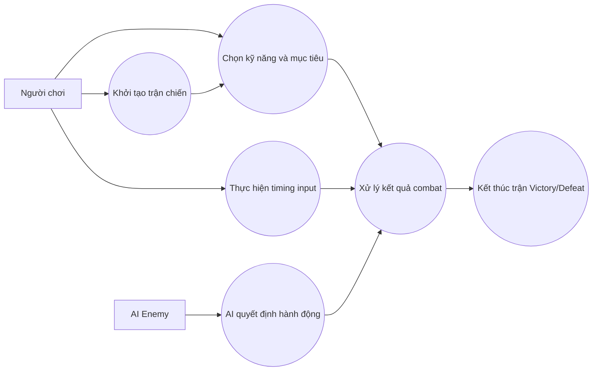

---

## 3. Thiết kế hệ thống

### 3.1 Kiến trúc tổng thể

Kiến trúc thực tế là kết hợp:
- Component-based domain model cho thực thể chiến đấu.
- Manager-based orchestration cho vòng đời trận.
- Event-driven integration giữa engine và các lớp presentation.
- Data-driven content bằng JSON.

### 3.2 Các module chính

- Core:
  - Constants, EventBus, RNGService, DataManager, SaveManager.
- Combat:
  - Entities, Components, Stats, Effects, Actions, AI, Managers, Timing.
- UI:
  - CombatUIController, BattleHUD, SkillButtonPanel, TurnOrderDisplay, ActionResultDisplay.
- Visual:
  - CharacterView, CharacterAnimator, ActionAnimationController, VFXController.
- Audio:
  - AudioController.

### 3.3 Thiết kế lớp và quan hệ

Thực thể cốt lõi:
- CombatEntity (abstract) gồm 3 component chính.
- Character kế thừa CombatEntity cho phe người chơi.
- Enemy kế thừa CombatEntity cho phe AI.

Bộ điều phối:
- CombatFlowController điều khiển state machine battle.
- TurnManager tính actor kế tiếp.
- SkillManager quản lý resource.
- ActionResolver xử lý kết quả hành động.

Lớp tích hợp hiển thị:
- CombatBridge và ActionAnimationController nhận event từ engine và phát animation.
- CombatUIController nhận event và cập nhật HUD/panel.

### 3.4 Thiết kế logic game

Luồng xử lý tổng quát:
1. StartBattle.
2. TurnManager chọn actor.
3. Player hoặc AI chọn action.
4. SkillAction validate và execute.
5. ActionResolver tính toán và apply hiệu ứng.
6. EndTurn, tick cooldown/effects.
7. Kiểm tra kết thúc trận.

---

## 4. Công nghệ sử dụng

### 4.1 Ngôn ngữ và engine

- C#.
- Unity (ProjectVersion: 6000.3.5f2).

Lý do:
- Unity phù hợp game 2D, quản lý scene tốt, package ecosystem phong phú.
- C# hỗ trợ tổ chức OOP tốt cho mô hình manager-component.

### 4.2 Framework và thư viện

- Unity Input System:
  - Quản lý action map cho keyboard/gamepad.
- DOTween:
  - Dùng cho tween UI và combat feel (lunge, fade, shake).
- TextMeshPro:
  - Hiển thị text combat rõ và linh hoạt.
- URP:
  - Tầng render hiện đại, phù hợp game 2D.

### 4.3 Công cụ dữ liệu

- JSON data trong Assets/Data cho character/skill/enemy/stage.
- ScriptableObject bổ trợ cho một số cấu hình AI/enemy.

---

## 5. Chi tiết triển khai

### 5.1 Cấu trúc dự án

Tổ chức thư mục chính:
- Assets/Scripts: mã nguồn gameplay.
- Assets/Data: dữ liệu nội dung.
- Assets/Docs: tài liệu kỹ thuật và sprint.
- Assets/Scenes: scene menu và scene test combat.
- Packages, ProjectSettings: cấu hình môi trường.

Số liệu từ codebase:
- 95 file C# trong Assets/Scripts.
- 19 file test script trong Assets/Scripts/Debug/Test.

### 5.2 Triển khai các tính năng trọng yếu

#### 5.2.1 Event Bus

EventBus được cài đặt singleton và cho phép Subscribe/Unsubscribe/Publish theo generic type.

```csharp
public void Subscribe<T>(Action<T> handler) where T : GameEvent
{
    lock (_lock)
    {
        Type eventType = typeof(T);
        if (!_subscribers.ContainsKey(eventType))
            _subscribers[eventType] = new List<Delegate>();

        _subscribers[eventType].Add(handler);
    }
}
```

Giá trị kiến trúc:
- Giảm coupling giữa combat logic và presentation.
- Nhiều hệ thống có thể phản hồi cùng một sự kiện (UI, audio, VFX).

#### 5.2.2 Turn Order CTB

TurnManager sử dụng gauge và ngưỡng TURN_THRESHOLD để chọn actor nhanh nhất đạt điều kiện đi lượt.

```csharp
float ticksNeeded = currentGauge >= TURN_THRESHOLD
    ? 0f
    : (TURN_THRESHOLD - currentGauge) / _speeds[id];
```

Sau hành động, gauge actor bị trừ actionCost, tạo khác biệt nhịp lượt giữa các kỹ năng.

#### 5.2.3 Action Pipeline

SkillAction chịu trách nhiệm validate và execute, còn ActionResolver áp dụng kết quả lên target.

```csharp
action.Execute(actor, targets, SkillManager.Instance, guard);
```

Trong ActionResolver:
- attack: tính damage, xét guard/timing bonus, apply damage và effect.
- heal: tính heal và áp dụng effect đi kèm.

#### 5.2.4 Timing System

TimingSystem mở cửa sổ thời gian, nhận input và trả về grade.

```csharp
public void OpenWindow(TimingWindow window)
{
    _activeWindow = window;
    _inputTime = null;
    _windowActive = true;
    _windowCoroutine = StartCoroutine(WindowLifecycle(window));
    OnWindowOpened?.Invoke(window.Duration);
}
```

Cơ chế này tích hợp trực tiếp vào CombatFlowController cho cả lượt player và enemy guard.

#### 5.2.5 AI Decision

AIController triển khai decision tree ưu tiên heal, strong attack, skill preference, rồi fallback basic attack.

```csharp
if (ShouldHeal(self, behavior)) { ... }
if (HasWeakEnemy(self, allEntities, behavior)) { ... }
foreach (string skillId in behavior.skillPreferences) { ... }
```

TargetSelector chọn mục tiêu theo rule như single_enemy, all_enemies, single_ally, random_enemy.

#### 5.2.6 UI Combat

CombatUIController đóng vai trò root orchestration cho UI:
- Initialize HUD, skill panel, turn order.
- Lắng nghe TurnStartedEvent và CombatEndedEvent.
- Đăng ký vị trí entity để spawn floating text.

BattleHUD cập nhật HP/MP theo event DamageTakenEvent, HealingReceivedEvent, ManaChangedEvent.

#### 5.2.7 Visual và Animation Bridge

ActionAnimationController lắng nghe SkillCastEvent và dựng sequence animation attack-hit-hurt-return.

```csharp
private void OnSkillCast(SkillCastEvent e)
{
    var attackerView = GetAnyView(e.CasterId);
    ...
    StartCoroutine(RunTrackedActionSequence(e.CasterId,
        PlayAttackSequence(attackerView, targetViews, useMeleeMovement: true)));
}
```

Cách làm này đảm bảo engine không phụ thuộc trực tiếp vào implementation cụ thể của animation clip.

#### 5.2.8 Save/Load

SaveManager ghi và đọc SaveData dưới dạng JSON tại persistentDataPath, hỗ trợ 3 slot.

```csharp
string json = JsonUtility.ToJson(CurrentSave, prettyPrint: true);
File.WriteAllText(GetFilePath(slotIndex), json);
```

### 5.3 Thuật toán và logic quan trọng

- Damage formula có xét defense cap và critical.
- Status effect tick theo StartTurn/EndTurn.
- Timeline preview mô phỏng không phá state thật để hiển thị UI.
- Input buffer cho timing giúp cải thiện trải nghiệm khi người chơi nhấn sớm.

---

## 6. Kiểm thử và đánh giá

### 6.1 Kiểm thử chức năng

Dự án có nhiều test script theo module, ví dụ:
- DataManagerTest.
- TurnManagerTest.
- ActionPipelineTest.
- TimingSystemTest.
- AudioControllerTest.

Các test chủ yếu theo hướng runtime integration trong scene Unity, phù hợp giai đoạn phát triển gameplay.

### 6.2 Đánh giá hiệu năng

Điểm tốt:
- Pooling được áp dụng ở các thành phần phát sinh nhiều object ngắn hạn.
- Dictionary/cache dùng cho truy xuất nhanh.
- Event-driven giảm polling thừa.

Điểm cần theo dõi:
- Dùng nhiều singleton yêu cầu kiểm soát vòng đời scene chặt chẽ.
- Một số fallback/placeholder có thể che mất lỗi pipeline asset nếu không có cảnh báo build rõ ràng.

### 6.3 Kết quả hiện tại

Đã hoạt động ổn định:
- Combat loop có thể chạy end-to-end.
- UI, animation, timing, audio đã kết nối với nhau qua EventBus.
- Data mẫu đủ để mô phỏng trận chiến tutorial.

Chưa hoàn tất hoàn toàn:
- Element advantage trong StatCalculator đang để TODO.
- Một số schema JSON chưa đồng bộ tuyệt đối với model C# trong vài trường hợp (ví dụ naming rewards/repeatClear).
- Chưa có pipeline kiểm thử tự động hóa liên tục.

---

## 7. Hạn chế và hướng phát triển

### 7.1 Hạn chế hiện tại

- Độ đồng bộ contract dữ liệu giữa JSON và model C# cần siết chặt hơn.
- Chưa hoàn thiện đầy đủ hệ meta ngoài combat.
- Test automation chưa ở mức production.
- Một phần visual pipeline vẫn có fallback runtime.

### 7.2 Đề xuất phát triển tiếp theo

1. Chuẩn hóa schema dữ liệu
- Tạo lớp validation nâng cao và quy tắc kiểm tra trước runtime.

2. Nâng chất lượng combat simulation
- Hoàn thiện bảng khắc chế nguyên tố.
- Mở rộng AI theo phase nâng cao và pattern boss rõ hơn.

3. Tăng độ tin cậy kỹ thuật
- Bổ sung unit test thuần cho các lớp tính toán (StatCalculator, ActionResolver).
- Thiết lập CI để chạy test định kỳ và phát hiện regression sớm.

4. Hoàn thiện vòng lặp sản phẩm
- Kết nối combat với reward/progression/menu flow đầy đủ.
- Chuẩn hóa asset pipeline để loại bỏ placeholder trong bản build chính thức.

---

## 8. Phân tích pattern trong hệ thống

Phần này tổng hợp các pattern thực sự đã xuất hiện trong mã nguồn, không chỉ liệt kê theo lý thuyết. Việc nhận diện pattern giúp đánh giá đúng mức độ trưởng thành kỹ thuật của dự án.

### 8.1 Architectural Pattern: Layered + Domain Modules

Hệ thống được chia lớp tương đối rõ:
- Core (hạ tầng chung).
- Combat (nghiệp vụ chiến đấu).
- UI/Visual/Audio (presentation).
- Data (định nghĩa và nội dung).

Đặc điểm:
- Combat không thao tác trực tiếp với UI qua lời gọi cứng, thay vào đó phát event.
- UI/Visual/Audio đăng ký lắng nghe sự kiện để tự cập nhật.

Ưu điểm:
- Giảm phụ thuộc vòng.
- Dễ thay thế từng lớp.

Đánh đổi:
- Luồng xử lý bị phân tán qua nhiều subscriber, khó trace nếu thiếu logging.

### 8.2 Singleton Pattern

Pattern singleton xuất hiện ở nhiều manager như EventBus, DataManager, SaveManager, SkillManager, TurnManager, CombatFlowController, CombatUIController, AudioController.

Ví dụ điển hình:

```csharp
private static EventBus _instance;
public static EventBus Instance
{
  get
  {
    if (_instance == null)
    {
      var go = new GameObject("[EventBus]");
      _instance = go.AddComponent<EventBus>();
      DontDestroyOnLoad(go);
    }
    return _instance;
  }
}
```

Ý nghĩa thực tiễn:
- Truy cập toàn cục thuận tiện cho runtime gameplay.
- Phù hợp prototype và dự án nhóm nhỏ.

Rủi ro kỹ thuật:
- Khó mock khi unit test thuần.
- Có thể phát sinh trùng instance giữa scene nếu không quản lý vòng đời chặt.

### 8.3 Observer Pattern (Event Bus)

Đây là pattern cốt lõi của dự án.

Ví dụ publish event:

```csharp
EventBus.Instance.Publish(new CombatEndedEvent(victory));
```

Ví dụ subscribe ở UI:

```csharp
EventBus.Instance.Subscribe<CombatEndedEvent>(OnCombatEnded);
```

Ý nghĩa:
- Tách producer và consumer.
- Một sự kiện có thể fan-out tới nhiều hệ thống (UI, animation, audio).

### 8.4 Factory Pattern

EntityFactory và CharacterViewFactory là hai điểm áp dụng rõ ràng.

Factory ở domain:

```csharp
var character = new Character(model, instanceIndex);
```

Factory ở presentation:
- Tạo CharacterView/EnemyView từ data model.
- Có fallback placeholder khi thiếu prefab.

Lợi ích:
- Chuẩn hóa quá trình tạo object.
- Cô lập logic khởi tạo phức tạp khỏi game flow chính.

### 8.5 Strategy/Policy-like Pattern trong AI

AIBehavior ScriptableObject đóng vai trò profile chiến lược, thay đổi hành vi mà không sửa AIController core.

Mẫu quyết định:
- Heal nếu HP thấp.
- Strong attack nếu có mục tiêu yếu.
- Skill preference.
- Fallback basic attack.

Đây là dạng strategy cấu hình bằng data asset.

### 8.6 Component Pattern cho CombatEntity

CombatEntity không ôm toàn bộ logic trong một lớp monolithic mà tách:
- HealthComponent.
- StatsComponent.
- EffectComponent.

Lợi ích:
- Tính kết hợp cao.
- Dễ kiểm thử và mở rộng từng phần.

### 8.7 Object Pool Pattern

Áp dụng trong ActionResultDisplay (FloatingText) và VFXController.

Ví dụ queue pool:

```csharp
private readonly Queue<FloatingText> _pool = new();
```

Giá trị thực tế:
- Giảm GC allocation trong combat loop có nhiều hiệu ứng ngắn hạn.

### 8.8 State Machine Pattern

CombatFlowController có enum CombatState và coroutine loop điều khiển chuyển trạng thái.

Đặc trưng:
- Idle -> Initializing -> PlayerTurn/EnemyTurn -> ExecutingAction -> CheckVictory -> BattleEnd.

Ý nghĩa:
- Luồng trận đấu rõ ràng, dễ mở rộng nhánh logic.

---

### 8.9 Minh họa Pattern: Event-Driven Integration

Sơ đồ dưới đây minh họa cách một event combat được lan truyền sang nhiều subsystem.

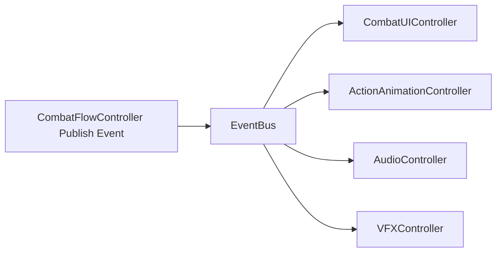

### 8.10 Minh họa Pattern: Factory + Component

Sơ đồ thể hiện phối hợp giữa Factory và Entity-Component khi dựng thực thể combat.

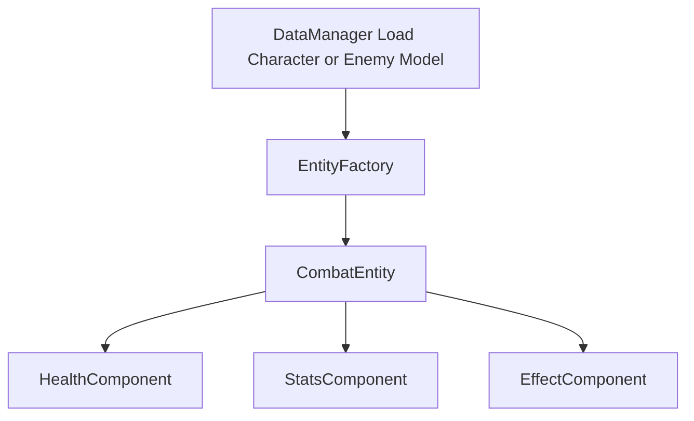

---

## 9. Phân tích thực thể và mô hình miền

### 9.1 Thực thể chiến đấu lõi

`CombatEntity` là thực thể nền cho cả `Character` và `Enemy`, được thiết kế theo composition với 3 component chính.

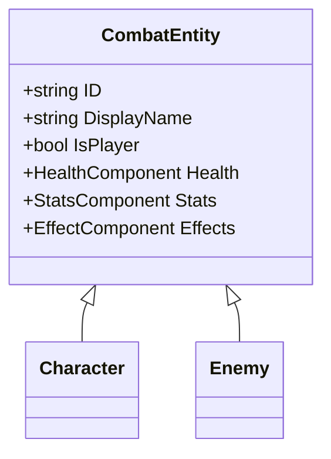

### 9.2 Các component nghiệp vụ của thực thể

- `HealthComponent`: HP, shield, death event.
- `StatsComponent`: chỉ số hiệu dụng và modifier.
- `EffectComponent`: thêm/tick/gỡ status effect.

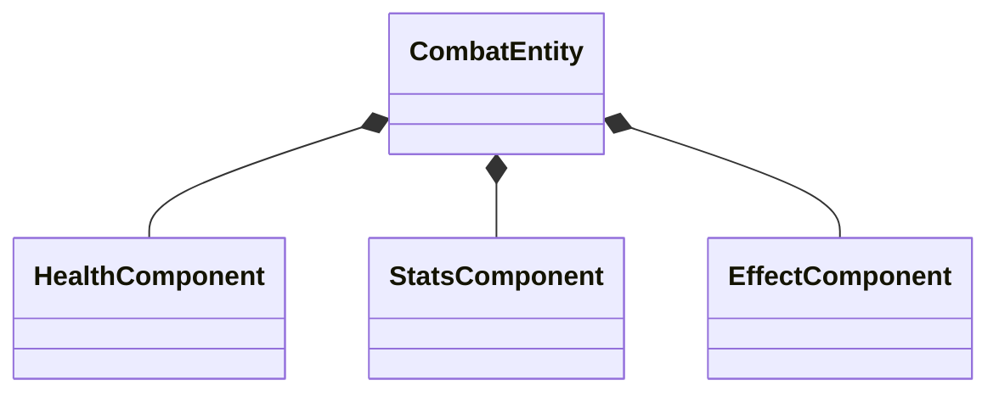

### 9.3 Hệ status effect

`StatusEffect` là lớp trừu tượng, các effect cụ thể kế thừa và override hành vi tick/stack/remove.

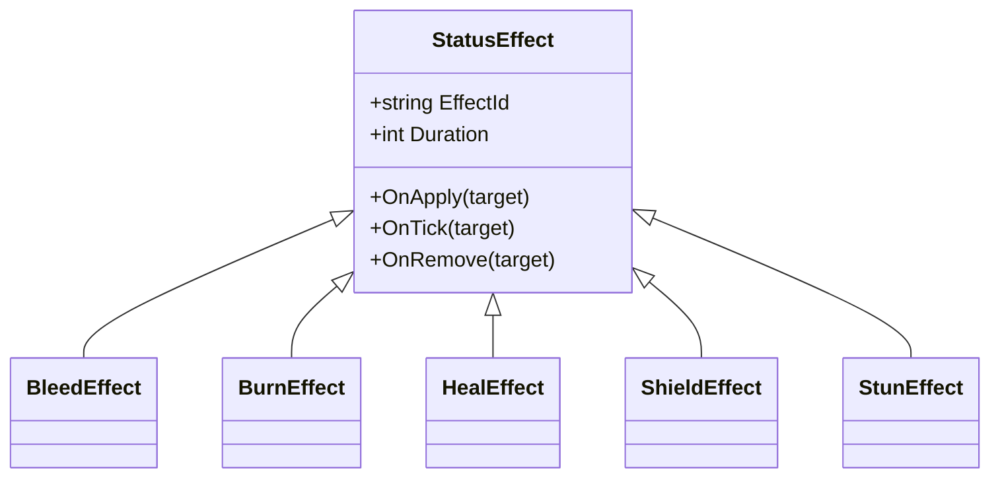

### 9.4 Thực thể dữ liệu (Data Model)

Thực thể runtime được cấp dữ liệu từ các model JSON:
- `CharacterDataModel`
- `SkillDataModel`
- `EnemyDataModel`
- `StageDataModel`

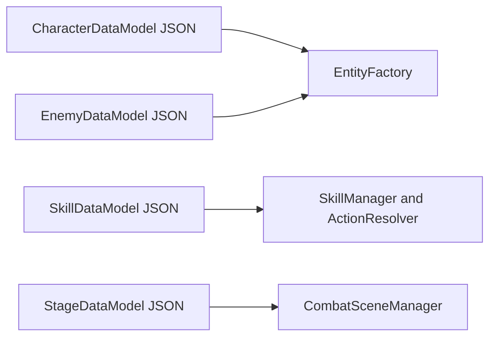

---

## 10. Phân tích luồng hệ thống

### 10.1 Luồng khởi tạo combat

1. `CombatSceneManager.InitializeCombat()` nhận stageId và party.
2. `DataManager` nạp dữ liệu stage/character/enemy.
3. `EntityFactory` dựng các thực thể `Character` và `Enemy`.
4. `SkillManager` và `TurnManager` đăng ký entity.
5. `CombatUIController` khởi tạo HUD và panel.
6. `CombatFlowController.StartBattle()` bắt đầu vòng lặp trận.

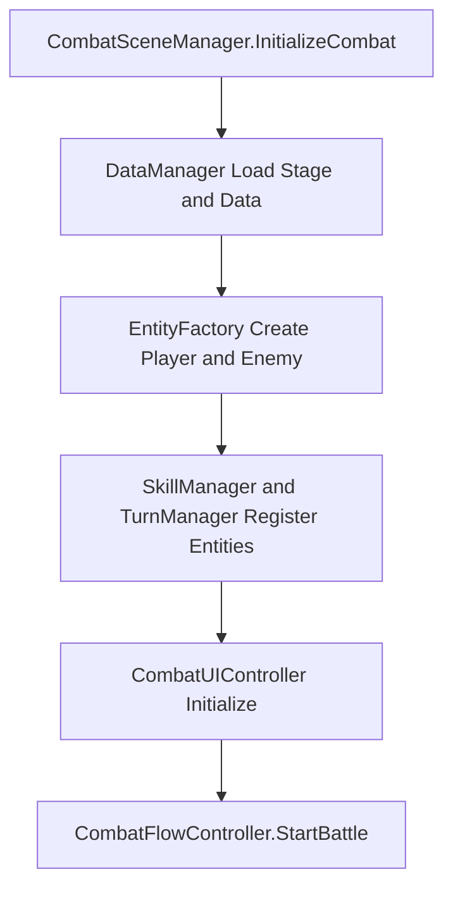

### 10.2 Luồng lượt người chơi

1. `TurnStartedEvent` phát đến UI.
2. Player chọn skill và target.
3. Nếu là skill attack thì mở timing window.
4. Hệ thống execute và resolve.
5. UI, animation, audio cập nhật qua event.

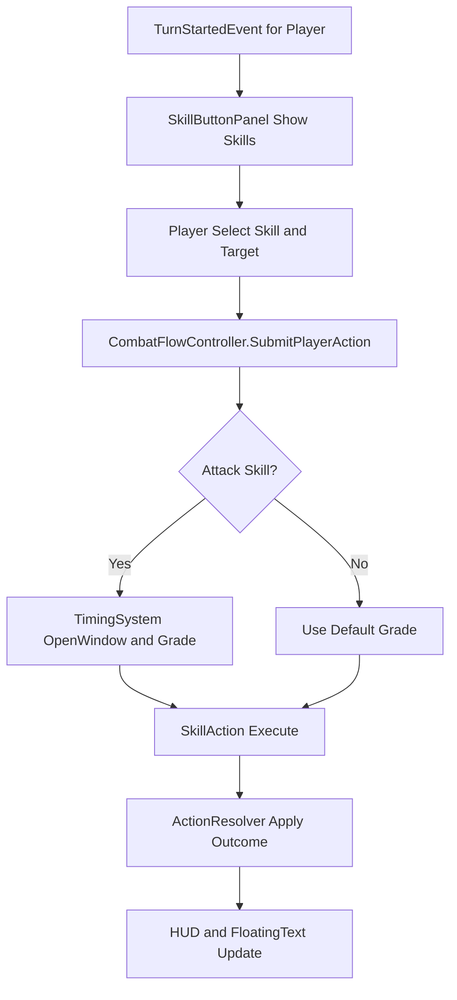

### 10.3 Luồng lượt AI

1. `EnemyTurnRoutine` tạo snapshot.
2. `AIController` quyết định action.
3. Fallback nếu không có action hợp lệ.
4. Execute action, tick cooldown, kết thúc lượt.

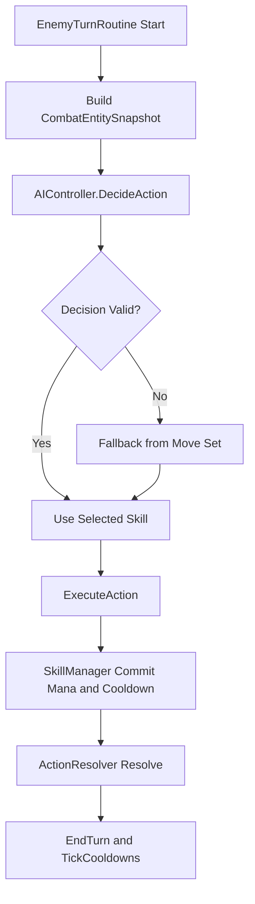

### 10.4 Luồng sự kiện cập nhật presentation

Sau mỗi hành động, presentation được đồng bộ bằng EventBus thay vì gọi trực tiếp.

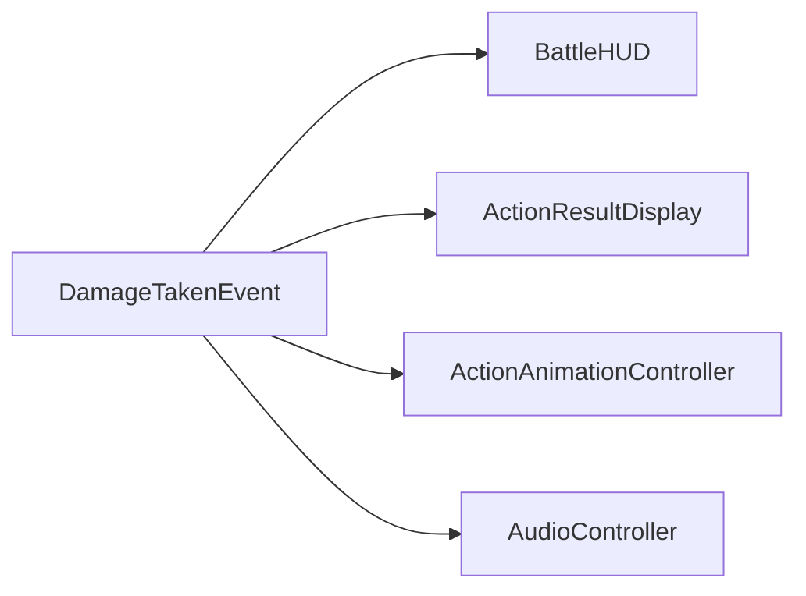

---

## Phụ lục: Danh sách file trọng điểm đã phân tích

- Assets/Scripts/Core/Events/EventBus.cs
- Assets/Scripts/Core/Data/DataManager.cs
- Assets/Scripts/Core/Save/SaveManager.cs
- Assets/Scripts/Combat/Managers/CombatFlowController.cs
- Assets/Scripts/Combat/Managers/TurnManager.cs
- Assets/Scripts/Combat/Managers/SkillManager.cs
- Assets/Scripts/Combat/Actions/ActionResolver.cs
- Assets/Scripts/Combat/Actions/SkillAction.cs
- Assets/Scripts/Combat/AI/AIController.cs
- Assets/Scripts/Combat/Timing/TimingSystem.cs
- Assets/Scripts/UI/Combat/CombatUIController.cs
- Assets/Scripts/UI/Combat/BattleHUD.cs
- Assets/Scripts/Visual/CharacterAnimator.cs
- Assets/Scripts/Visual/VFX/VFXController.cs
- Assets/Scripts/Audio/AudioController.cs
- Assets/Data/Characters/char_warrior.json
- Assets/Data/Characters/char_mage.json
- Assets/Data/Skills/skill_warrior_slash.json
- Assets/Data/Skills/skill_mage_fireball.json
- Assets/Data/Enemies/enemy_bandit.json
- Assets/Data/Enemies/enemy_henry.json
- Assets/Data/Stages/stage_01_tutorial.json
