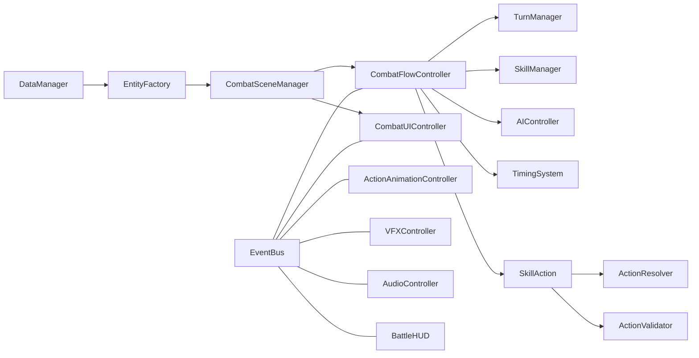

# 01 - Cấu Trúc Hệ Thống

## 1. Sơ đồ thư mục tổng thể

```text
Assets/
  Data/                            # JSON dữ liệu game (characters, skills, enemies, stages)
  Scenes/                          # Unity scenes
  Scripts/
    Audio/                         # Điều phối âm thanh (SFX/BGM)
    Combat/
      Actions/                     # Action pipeline (validate/resolve/execute)
      AI/                          # AI quyết định skill/target
      Components/                  # Health/Stats/Effect components
      Effects/                     # Các status effect cụ thể
      Entities/                    # CombatEntity, Character, Enemy, Factory
      Managers/                    # Orchestration manager trong combat
      Stats/                       # Công thức và cấu trúc stat
      Timing/                      # Timing window/input/parry
    Core/
      Data/                        # DataManager, cache, validator
      Events/                      # EventBus và event contracts
      Save/                        # SaveData/SaveManager/SaveSlot
      Utilities/                   # RNGService và helper utilities
    Data/                          # DataModel và ScriptableObject wrappers
    Debug/                         # Logger và test harness
    UI/Combat/                     # UI combat (HUD, skill panel, turn order, timing UI)
    Visual/                        # Character view/animation/telegraph/VFX
    Utils/                         # Generic singleton helper
  Docs/ProjectDeepDive/            # Bộ tài liệu này
```

## 2. Nhóm module theo vai trò

- Nhóm điều phối runtime:
  - `CombatSceneManager`, `CombatFlowController`
- Nhóm logic miền combat:
  - `TurnManager`, `SkillManager`, `SkillAction`, `ActionResolver`, `CombatEntity`, `AIController`, `TimingSystem`
- Nhóm hạ tầng dùng chung:
  - `DataManager`, `SaveManager`, `EventBus`, `RNGService`
- Nhóm hiển thị:
  - `CombatUIController`, `BattleHUD`, `TurnOrderDisplay`, `ActionAnimationController`, `VFXController`, `AudioController`

## 3. Các điểm vào chính (entry points)

- Khởi tạo combat scene:
  - `CombatSceneManager.InitializeCombat(stageId, partyIds, seed)`
- Bắt đầu vòng lặp trận đấu:
  - `CombatFlowController.StartBattle(players, enemies, seed)`
- Chọn actor đến lượt:
  - `TurnManager.GetNextActor()`
- Người chơi gửi hành động:
  - `CombatFlowController.SubmitPlayerAction(skillId, targetIds)`
- AI quyết định hành động enemy:
  - `AIController.DecideAction(...)`
- Mở cửa sổ timing/parry:
  - `TimingSystem.OpenWindow(window)`

## 4. Tất cả nhóm luồng trong dự án

- Luồng khởi tạo dữ liệu và scene.
- Luồng tạo entity và đăng ký manager.
- Luồng turn CTB theo tốc độ.
- Luồng người chơi chọn skill.
- Luồng enemy AI chọn skill/target.
- Luồng timing/parry và phản hồi UI.
- Luồng resolve damage/heal/effect.
- Luồng cập nhật HUD/floating text/turn order.
- Luồng animation bridge và highlight actor.
- Luồng VFX theo event combat.
- Luồng Audio theo event combat.
- Luồng kết thúc trận và hiển thị kết quả.
- Luồng save/load profile.
- Luồng debug/test harness.

## 5. Quan hệ module (mức cao)



### Mô tả văn bản
- DataManager cấp dữ liệu cho EntityFactory.
- CombatSceneManager tạo ngữ cảnh chiến đấu và khởi chạy CombatFlowController.
- CombatFlowController là trung tâm điều phối turn và action.
- EventBus phân phối kết quả combat sang UI, Visual và Audio.

## 6. Mối liên hệ tài liệu

- File `02`: mô tả toàn bộ luồng runtime.
- File `07`: map chi tiết class/hàm theo từng luồng.
- File `08`: tra cứu tất cả class/interface/enum.
