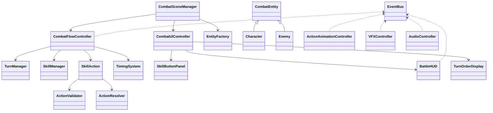

# 03 - Kiến Trúc Mã Nguồn (Class-Level)

## 1. Nguyên tắc thiết kế đang áp dụng

- Tách điều phối và xử lý nghiệp vụ:
  - Điều phối: `CombatSceneManager`, `CombatFlowController`.
  - Nghiệp vụ: turn, action, entity, effect, AI.
- Tách resource và outcome:
  - `SkillManager` xử lý mana/cooldown/limit.
  - `ActionResolver` xử lý damage/heal/effects.
- Tách engine và presentation:
  - Combat logic publish event.
  - UI/Visual/Audio subscribe event để hiển thị.

## 2. Ma trận trách nhiệm chính

| Class | Trách nhiệm | Không nên làm |
|---|---|---|
| CombatSceneManager | Dựng bối cảnh combat scene, init dữ liệu/UI/view | Không tính damage |
| CombatFlowController | Điều phối vòng lặp trận đấu | Không giữ dữ liệu UI |
| TurnManager | Lập lịch lượt theo gauge/tốc độ | Không xử lý skill data |
| SkillManager | Quản lý tài nguyên dùng skill | Không resolve outcome |
| SkillAction | Bao gói validate + execute 1 action | Không quản lý battle loop |
| ActionValidator | Kiểm tra điều kiện hợp lệ trước execute | Không mutate combat state |
| ActionResolver | Áp kết quả skill lên targets | Không trừ mana/cd |
| CombatEntity | Gom component và hooks theo lượt | Không xử lý UI |
| TimingSystem | Quản lý cửa sổ timing | Không quyết định AI |
| CombatUIController | Điều phối panel UI combat | Không tự ý thay combat state |

## 3. Quan hệ lớp trọng tâm

## 4. Điểm cần chú ý khi mở rộng

- Mở rộng skill mới:
  - map effect type ở `ActionResolver.BuildStatusEffect`.
- Mở rộng target rule:
  - cập nhật `TargetSelector.SelectTargets` và UI resolve target.
- Mở rộng event:
  - thêm contract ở `CombatEvents.cs` và cập nhật tài liệu file `05`.

## 5. Điểm rủi ro kỹ thuật cần theo dõi

- Đăng ký event trùng lặp do subscribe không đối xứng.
- Manager singleton `DontDestroyOnLoad` tạo xung đột khi scene reload.
- Cleanup entity chết không đồng bộ giữa timeline, skill manager và entity list.
