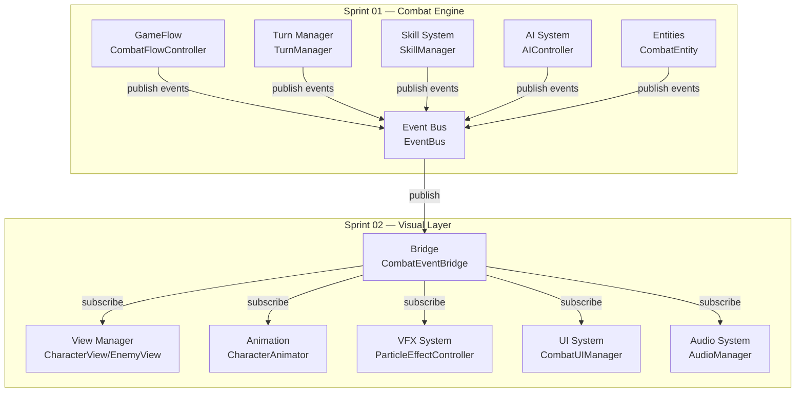

# 02 — Dependency Map — Sprint 02 & Sprint 01 Integration

## 1. Module Dependency Graph



---

## 2. Per-Module Dependencies

### 2.1 CombatEventBridge (Main integration point)

**Depends on:**
- `TTCS.Core.Events.EventBus` — subscribe to combat events
- `TTCS.Combat.Managers.CombatFlowController` — read state (optional, for current actor)
- `TTCS.Visual.Views.CharacterView` — call visual update methods
- `TTCS.Visual.Animation.CharacterAnimator` — call animation methods
- `TTCS.Visual.Effects.ParticleEffectController` — trigger VFX
- `TTCS.Visual.UI.CombatUIManager` — update UI
- `TTCS.Visual.Audio.AudioManager` — play sounds

**Publishes:**
- `AnimationFinished` (custom Visual events)
- `VFXFinished`
- `ActionCompleted`

---

### 2.2 CharacterView / EnemyView

**Depends on:**
- `TTCS.Combat.Entities.CombatEntity` — read user/enemy reference
- `TTCS.Visual.Animation.CharacterAnimator` — own animator logic
- `TTCS.Visual.Effects.EffectIndicatorUI` — display buffs/debuffs

**Methods called by CombatEventBridge:**
- `PlayDamageVisual(int damage)`
- `PlayHealingVisual(int healing)`
- `PlayActionAnimation(string actionId)`
- `SetPosition(Vector3 pos)`
- `Shake()` — screen shake on impact

---

### 2.3 CharacterAnimator

**Depends on:**
- Unity `Animator` component
- `TTCS.Combat.Actions.IAction` — read action properties (timing, type)
- `TTCS.Visual.Effects.ParticleEffectController` — trigger attached VFX

**Methods called by CombatEventBridge:**
- `PlayAnimation(string stateName)`
- `SetDamageKnockback(Vector3 direction)`
- `SetAttackDirection(Vector3 targetPos)`
- `GetCurrentAnimationDuration()` → float

**State Machine:**
```
States:
  - Idle
  - Attack (varies by action type)
  - Hit
  - Dodge
  - Death
  - Heal
  - BuffApplied
```

---

### 2.4 ParticleEffectController

**Depends on:**
- `TTCS.Combat.Effects.StatusEffect` — read effect type (Poison, Burn, etc)
- `TTCS.Visual.Effects.FloatingTextController` — trigger damage numbers
- Unity `ParticleSystem` component

**Methods called by CombatEventBridge:**
- `PlaySkillVFX(string skillId, Vector3 position)` → wait for finish
- `PlayDamageVFX(int damage, Vector3 position)`
- `PlayHealingVFX(int healing, Vector3 position)`
- `PlayStatusEffectVFX(string effectType)`

**Custom Events:**
- `OnVFXFinished(string vfxId)` — published when particle finishes

---

### 2.5 CombatUIManager

**Depends on:**
- `TTCS.Combat.Entities.CombatEntity` — read healthBars for update
- `TTCS.Combat.Managers.TurnManager` — read turn order
- `TTCS.Visual.UI.ActionPanel` — delegate to action selection
- `TTCS.Visual.UI.StatusDisplay` — delegate to status view
- `TTCS.Visual.UI.TurnOrderDisplay` — delegate to turn preview

**Methods called by CombatEventBridge:**
- `OnSkillCast(SkillCastEvent evt)`
- `OnDamageTaken(DamageTakenEvent evt)` → update health bar
- `OnHealing(HealingEvent evt)` → update health bar
- `OnTurnChanged(TurnChangedEvent evt)` → update turn UI

---

### 2.6 ActionPanel

**Depends on:**
- `TTCS.Combat.Managers.SkillManager` — read available skills
- User input system

**Methods called by CombatUIManager:**
- `EnablePanel()`
- `DisablePanel()`
- `SetSkillButtonState(int skillSlot, SkillButtonState state)`

**Events published:**
- `OnSkillSelected(int skillId)` — listened by CombatEventBridge → forward to Combat

---

### 2.7 AudioManager

**Depends on:**
- Unity `AudioSource` component
- Audio clip database (external JSON or prefab asset)

**Methods called by CombatEventBridge:**
- `PlaySFX(string sfxId)` — play sound effect
- `PlayBGM(string bgmId)` — loop background music
- `StopSFX(string sfxId)`
- `SetVolume(float master, float sfx, float music, float voice)`

**Audio Types:**
- SFX (skill hits, damage sounds, UI confirm)
- BGM (battle music loop)
- Voice (character voice lines — future)

---

## 3. Event Flow Diagram

### 3.1 Skill Cast Event Chain

```
Combat Engine (Sprint 01):
1. SkillManager.CastSkill(skillId, caster, targets)
2. Validate + Create SkillAction
3. Publish "SkillCastStartedEvent"

EventBus:
4. All SkillCastStartedEvent subscribers notified

Visual Layer (Sprint 02):
5. CombatEventBridge.OnSkillCastStarted(evt)
   ├─ CharacterAnimator.PlayAnimation("Attack")
   ├─ ParticleEffectController.PlaySkillVFX(skillId)
   ├─ AudioManager.PlaySFX(skillId)
   └─ TelegraphVisual.Show(targets) [future]

6. Wait for exact timing moment (actionResolver.damageFrame)

7. ActionResolver.ResolveDamage() — applies actual damage
8. Combat publishes "DamageTakenEvent"

9. CombatEventBridge.OnDamageTaken(evt)
   ├─ CharacterView.PlayHitAnimation()
   ├─ FloatingTextController.ShowDamageNumber(damage)
   ├─ ParticleEffectController.PlayDamageImpact()
   └─ AudioManager.PlaySFX("HitSound")

10. ActionResolver.Finish()
11. Combat publishes "ActionFinishedEvent"

12. CombatEventBridge.OnActionFinished(evt)
    └─ CharacterAnimator.PlayAnimation("Idle")
```

---

### 3.2 Damage Number Flow

```
DamageTakenEvent → CombatEventBridge.OnDamageTaken()
    ↓
FloatingTextController.ShowDamageNumber(damage, position)
    ├─ Get pooled FloatingText object
    ├─ Update text: "-50"
    ├─ Set color: Red (damage) / Green (heal)
    ├─ Position at character
    └─ Tween up + fade out (0.8s duration)
    
After 0.8s:
    └─ Return to pool
```

---

### 3.3 Turn Order Update Flow

```
TurnManager.OnTurnChanged() [Sprint 01]
    ↓
Publish "TurnChangedEvent" with nextActorId, turnCount
    ↓
CombatEventBridge.OnTurnChanged()
    ↓
TurnOrderDisplay.UpdateTurnOrder(newOrder)
    ├─ Highlight current actor
    └─ Show next 3 upcoming actors
```

---

## 4. Dependency Constraints

### 4.1 Sprint 02 CAN import from Sprint 01:

```csharp
using TTCS.Combat.Entities;        // ✓ Read-only entity reference
using TTCS.Combat.Managers;        // ✓ To query state
using TTCS.Combat.Actions;         // ✓ To read action properties
using TTCS.Core.Events;             // ✓ EventBus for subscription
using TTCS.Core.Data;               // ✓ To access data models
```

### 4.2 Sprint 02 CANNOT:

```csharp
// ❌ Direct method calls into Combat logic
CombatFlowController.Instance.ExecuteAction();

// ❌ Instantiate Combat entities directly
var entity = new CombatEntity();

// ❌ Modify Combat entity state
entity.HealthComponent.CurrentHP = 100;
```

### 4.3 Sprint 01 MUST NOT import Sprint 02:

```csharp
// ❌ Combat should never know about Visual layer
using TTCS.Visual.Views;
using TTCS.Visual.UI;
```

---

## 5. Critical Integration Points

### Integration Point #1: EventBus subscription (Bootstrap)

```csharp
// In CombatEventBridge.Start() or bootstrap
EventBus.Subscribe<SkillCastStartedEvent>(OnSkillCastStarted);
EventBus.Subscribe<DamageTakenEvent>(OnDamageTaken);
EventBus.Subscribe<HealingEvent>(OnHealing);
EventBus.Subscribe<EntityDiedEvent>(OnEntityDied);
// ... etc

// On application quit
EventBus.Unsubscribe<SkillCastStartedEvent>(OnSkillCastStarted);
```

### Integration Point #2: Bridge event translation

```csharp
// CombatEventBridge forwards UI input → Combat command
public void OnSkillButtonClicked(int skillId) {
    // ✓ Publish event that CombatFlowController listens to
    EventBus.Publish(new PlayerSkillSelectedEvent(skillId));
    
    // ❌ Do NOT call: CombatFlowController.ExecuteSkill(skillId)
}
```

### Integration Point #3: Timing synchronization

```csharp
// ActionAnimationController must respect timing from ActionResolver
public IEnumerator PlayAttackAnimation(ActionSnapshot action) {
    float duration = action.AnimationDuration;
    float damageFrameTime = action.DamageFrameTime;
    
    animator.SetTrigger("Attack");
    yield return new WaitForSeconds(damageFrameTime);
    // ← Combat applies damage at this exact moment
    
    yield return new WaitForSeconds(duration - damageFrameTime);
    // animation finishes
}
```

---

## 6. Dependency Version Matrix

| Component | Sprint 01 API | Breaking Changes | Notes |
|-----------|---------------|------------------|-------|
| EventBus | v1.0 | None planned | Stable interface |
| SkillCastEvent | v1.0 | None planned | Contains skillId, caster, targets |
| ActionResolver | v1.0 | Timing precision ±50ms | Tolerance 50ms in visual timing |
| CombatEntity | v1.0 | ComponentAccess | Visual accesses ID, Health only |

---

## 7. Circular Dependency Prevention

**Circular Dependency Pattern:**
```
❌ BAD:
Combat → Visual (calls animation method)
Visual → Combat (queries entity state)

✓ GOOD:
Combat → EventBus (publishes)
EventBus ← Visual (subscribes)
Visual → Combat (read-only query)
```

**Always use:**
- EventBus for communication ✓
- Read-only interfaces for state access ✓
- One-direction dependencies ✓

---

## 8. Testing Dependencies

For unit testing Visual components:

```csharp
// Create mock Combat events without spawn real engine
var mockEvent = new DamageTakenEvent {
    EntityId = "char_player",
    Damage = 45,
    Position = Vector3.zero
};

// Test Visual layer in isolation
characterView.OnDamageTaken(mockEvent);
Assert.AreEqual(expectedAnimState, animator.GetCurrentAnimatorStateInfo(0).shortNameHash);
```

---

## 9. Dependency Installation Checklist

When importing Sprint 02 into new project:

- [ ] Ensure EventBus is initialized before Visual layer
- [ ] Register all event subscribers in CombatEventBridge.Start()
- [ ] Verify ActionAnimationConfig.json matches Sprint 01 ActionResolver timing
- [ ] Check prefab asset references (Character, Enemy, VFX)
- [ ] Validate audio clip references in AudioManager
- [ ] Run integration test scene to verify SkillCast → Animation → Damage chain

