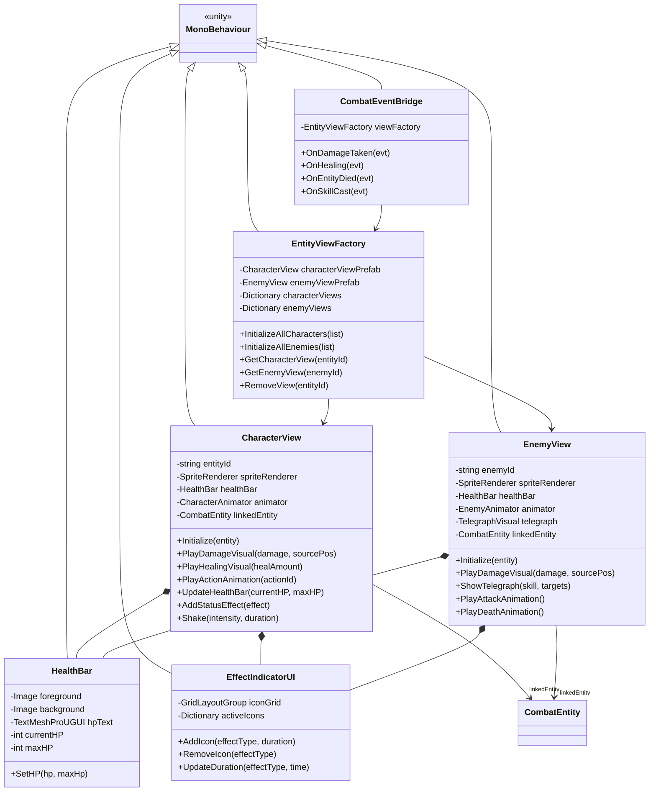
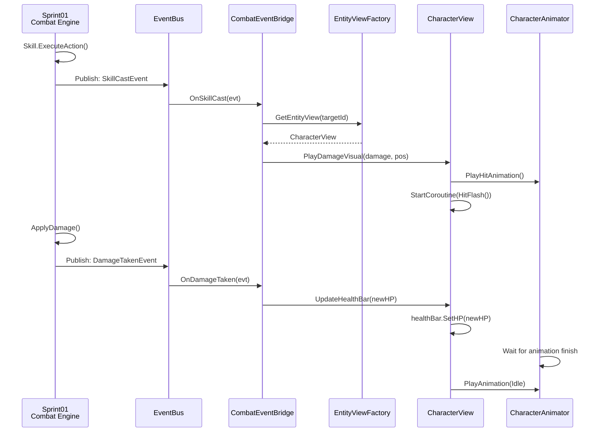
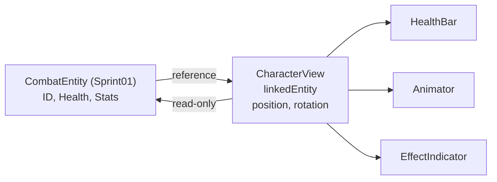

# 03a — Visual Framework — Mermaid Diagrams

## Class Hierarchy

```mermaid
classDiagram
    class MonoBehaviour {
        <<unity>>
    }
    
    class CharacterView {
        -string entityId
        -SpriteRenderer spriteRenderer
        -HealthBar healthBar
        -CharacterAnimator animator
        -CombatEntity linkedEntity
        +Initialize(entity)
        +PlayDamageVisual(damage, sourcePos)
        +PlayHealingVisual(healAmount)
        +PlayActionAnimation(actionId)
        +UpdateHealthBar(currentHP, maxHP)
        +AddStatusEffect(effect)
        +Shake(intensity, duration)
    }
    
    class EnemyView {
        -string enemyId
        -SpriteRenderer spriteRenderer
        -HealthBar healthBar
        -EnemyAnimator animator
        -TelegraphVisual telegraph
        -CombatEntity linkedEntity
        +Initialize(entity)
        +PlayDamageVisual(damage, sourcePos)
        +ShowTelegraph(skill, targets)
        +PlayAttackAnimation()
        +PlayDeathAnimation()
    }
    
    class HealthBar {
        -Image foreground
        -Image background
        -TextMeshProUGUI hpText
        -int currentHP
        -int maxHP
        +SetHP(hp, maxHp)
    }
    
    class EffectIndicatorUI {
        -GridLayoutGroup iconGrid
        -Dictionary activeIcons
        +AddIcon(effectType, duration)
        +RemoveIcon(effectType)
        +UpdateDuration(effectType, time)
    }
    
    class EntityViewFactory {
        -CharacterView characterViewPrefab
        -EnemyView enemyViewPrefab
        -Dictionary characterViews
        -Dictionary enemyViews
        +InitializeAllCharacters(list)
        +InitializeAllEnemies(list)
        +GetCharacterView(entityId)
        +GetEnemyView(enemyId)
        +RemoveView(entityId)
    }
    
    class CombatEventBridge {
        -EntityViewFactory viewFactory
        +OnDamageTaken(evt)
        +OnHealing(evt)
        +OnEntityDied(evt)
        +OnSkillCast(evt)
    }
    
    MonoBehaviour <|-- CharacterView
    MonoBehaviour <|-- EnemyView
    MonoBehaviour <|-- HealthBar
    MonoBehaviour <|-- EffectIndicatorUI
    MonoBehaviour <|-- EntityViewFactory
    MonoBehaviour <|-- CombatEventBridge
    
    CharacterView *-- HealthBar
    CharacterView *-- EffectIndicatorUI
    CharacterView --> "linkedEntity" CombatEntity
    EnemyView *-- HealthBar
    EnemyView *-- EffectIndicatorUI
    EnemyView --> "linkedEntity" CombatEntity
    
    EntityViewFactory --> CharacterView
    EntityViewFactory --> EnemyView
    CombatEventBridge --> EntityViewFactory
```

## Interaction Flow Diagram

```mermaid
sequenceDiagram
    participant Combat as Sprint01<br/>Combat Engine
    participant EventBus as EventBus
    participant Bridge as CombatEventBridge
    participant Factory as EntityViewFactory
    participant CharView as CharacterView
    participant Anim as CharacterAnimator

    Combat->>Combat: Skill.ExecuteAction()
    Combat->>EventBus: Publish: SkillCastEvent
    
    EventBus->>Bridge: OnSkillCast(evt)
    Bridge->>Factory: GetEntityView(targetId)
    Factory-->>Bridge: CharacterView
    
    Bridge->>CharView: PlayDamageVisual(damage, pos)
    CharView->>Anim: PlayHitAnimation()
    CharView->>CharView: StartCoroutine(HitFlash())
    
    Combat->>Combat: ApplyDamage()
    Combat->>EventBus: Publish: DamageTakenEvent
    
    EventBus->>Bridge: OnDamageTaken(evt)
    Bridge->>CharView: UpdateHealthBar(newHP)
    CharView->>CharView: healthBar.SetHP(newHP)
    
    Anim->>Anim: Wait for animation finish
    CharView->>Anim: PlayAnimation(Idle)
```

## Data Structure Diagram

```mermaid
graph LR
    CombatEntity["CombatEntity (Sprint01)<br/>ID, Health, Stats"]
    CharView["CharacterView<br/>linkedEntity<br/>position, rotation"]
    
    CombatEntity -->|reference| CharView
    CharView -->|read-only| CombatEntity
    
    CharView --> HealthBar
    CharView --> Animator
    CharView --> EffectIndicator
```
